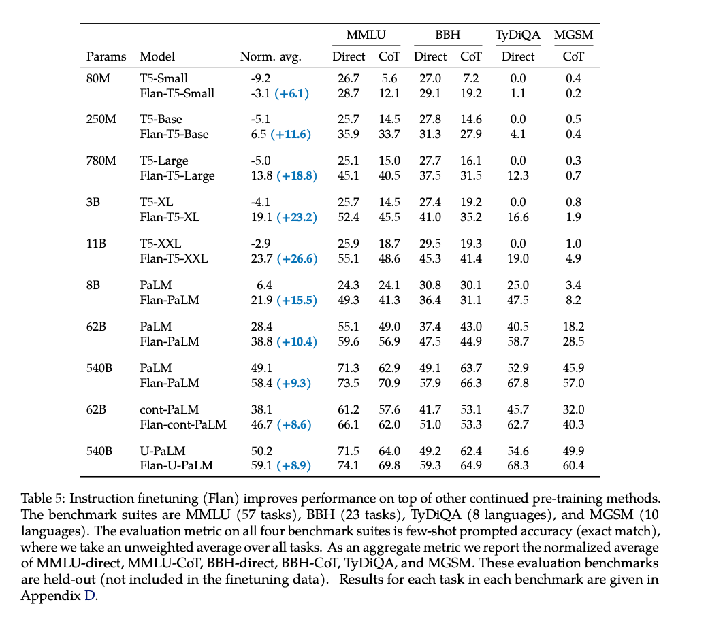

# 30 minutes to running LLMs on LangChain in a local environment

Within (30) minutes of reading this post, you should be able to complete model serving requests from two popular python-based large language models (LLM) using LangChain on your local computer without requiring the connection or costs to an external 3rd party API server, such as HuggingFaceHub or OpenAI.  

## Why run local

Some of the reasons why you may need to run your model locally, and not use an external API server, include:

* Security
    * You might want to fine tune the model and not post the derivative model on an external API server.
* Cost
    * You might want to avoid paying an external company for API calls. 
* Performance
    * You might need to manage your model's response times by using a private network and/or a specific server / processor type.
* Functionality
    * Your model might only run locally (i.e. blenderbot).

This project provides the code and process to run two types of pretrained, large language models (Flan-T5-Large and Sentence-BERT, all-MiniLM-L6-v2) using LangChain on your local computer. We selected these top performing models because several developers were having trouble running a tutorial locally, as tracked in this github issue, [https://github.com/hwchase17/LangChain/issues/4438](https://github.com/hwchase17/langchain/issues/4438).  

## LLM #1 - Flan-T5-Large

First, we will show the process to run the Flan-T5-Large model.   This transformer model is designed for natural language processing tasks and provides both text-to-text and text generation capabilities. It is based on the T5 (Text-To-Text Transfer Transformer) architecture and has 780M parameters.  This [paper](https://arxiv.org/pdf/2210.11416.pdf), which provides the following chart, and claims that the Flan-T5-Large achieved a MMLU score of 45.1%, which is pretty good when compared to ChatGPT3's score of 43.9% (see page 10). It is a fairly popular model, which had 446,125 downloads last month. For more detailed information on this model’s background, performance and capabilities, please see this link on HuggingFaceHub, [https://huggingface.co/google/flan-t5-large](https://huggingface.co/google/flan-t5-large).  



## LLM #2 - S BERT, all-MiniLM-L6-v2

Second we will show a sentence-transformer model, specifically the BertModel  model_name='all-MiniLM-L6-v2'.  This model maps sentences & paragraphs to a 384 dimensional dense vector space and can be used for tasks like clustering or semantic search.  This model has been extensively evaluated for embedded sentences (Performance Sentence Embeddings) and for embedded search queries & paragraphs (Performance Semantic Search). 

The model is a general purpose model and was trained with more than 1 billion training pairs. The **all-MiniLM-L6-v2** is relatively small (80MB) and fast, yet it still offers good quality.  It is a very popular model and had 2,674,926 downloads last month.  The text below is from this page, [https://www.sbert.net/docs/pretrained_models.html](https://www.sbert.net/docs/pretrained_models.html). For more detailed information on this model’s background, performance and capabilities, please see this link [https://huggingface.co/sentence-transformers/all-MiniLM-L6-v2](https://huggingface.co/sentence-transformers/all-MiniLM-L6-v2).  

### SBERT.net, Sentence-Transformers - Pretrained Models

We provide various pre-trained models. Using these models is easy:

**from** **sentence_transformers** **import** SentenceTransformer

model = SentenceTransformer('model_name')

All models are hosted on the [HuggingFace Model Hub](https://huggingface.co/sentence-transformers).

### Model Overview

The following table provides an overview of (selected) models. They have been extensively evaluated for their quality to embedded sentences (Performance Sentence Embeddings) and to embedded search queries & paragraphs (Performance Semantic Search).

The **all-*** models where trained on all available training data (more than 1 billion training pairs) and are designed as **general purpose** models. The **all-mpnet-base-v2** model provides the best quality, while **all-MiniLM-L6-v2** is 5 times faster and still offers good quality. Toggle _All models_ to see all evaluated models or visit [HuggingFace Model Hub](https://huggingface.co/models?library=sentence-transformers) to view all existing sentence-transformers models.


## LangChain - What is it? Why use it?

The text in this section is from [https://python.LangChain.com/en/latest/index.html](https://python.langchain.com/en/latest/index.html) 

LangChain is a framework for developing applications powered by language models. We believe that the most powerful and differentiated applications will not only call out to a language model, but will also be:

1. _Data-aware_: connect a language model to other sources of data
2. _Agentic_: allow a language model to interact with its environment

The LangChain framework is designed around these principles.  This is the Python specific portion of the documentation. For a purely conceptual guide to LangChain, see [here](https://docs.langchain.com/docs/). For the JavaScript documentation, see [here](https://js.langchain.com/docs/). For concepts and terminology, please see [here](https://python.langchain.com/en/latest/getting_started/concepts.html).

### Modules

These modules are the core abstractions which we view as the building blocks of any LLM-powered application. For each module LangChain provides standard, extendable interfaces. LangChain also provides external integrations and even end-to-end implementations for off-the-shelf use. The docs for each module contain quickstart examples, how-to guides, reference docs, and conceptual guides.

The modules are (from least to most complex):

* [Models](https://python.langchain.com/en/latest/modules/models.html): Supported model types and integrations.
* [Prompts](https://python.langchain.com/en/latest/modules/prompts.html): Prompt management, optimization, and serialization.
* [Memory](https://python.langchain.com/en/latest/modules/memory.html): Memory refers to the state that is persisted between calls of a chain/agent.
* [Indexes](https://python.langchain.com/en/latest/modules/indexes.html): Language models become much more powerful when combined with application-specific data - this module contains interfaces and integrations for loading, querying and updating external data.
* [Chains](https://python.langchain.com/en/latest/modules/chains.html): Chains are structured sequences of calls (to an LLM or to a different utility).
* [Agents](https://python.langchain.com/en/latest/modules/agents.html): An agent is a Chain in which an LLM, given a high-level directive and a set of tools, repeatedly decides an action, executes the action and observes the outcome until the high-level directive is complete.
* [Callbacks](https://python.langchain.com/en/latest/modules/callbacks/getting_started.html): Callbacks let you log and stream the intermediate steps of any chain, making it easy to observe, debug, and evaluate the internals of an application.

### Use Cases

Best practices and built-in implementations for common LangChain use cases:

* [Autonomous Agents](https://python.langchain.com/en/latest/use_cases/autonomous_agents.html): Autonomous agents are long-running agents that take many steps in an attempt to accomplish an objective. Examples include AutoGPT and BabyAGI.
* [Agent Simulations](https://python.langchain.com/en/latest/use_cases/agent_simulations.html): Putting agents in a sandbox and observing how they interact with each other and react to events can be an effective way to evaluate their long-range reasoning and planning abilities.
* [Personal Assistants](https://python.langchain.com/en/latest/use_cases/personal_assistants.html): One of the primary LangChain use cases. Personal assistants need to take actions, remember interactions, and have knowledge about your data.
* [Question Answering](https://python.langchain.com/en/latest/use_cases/question_answering.html): Another common LangChain use case. Answering questions over specific documents, only utilizing the information in those documents to construct an answer.
* [Chatbots](https://python.langchain.com/en/latest/use_cases/chatbots.html): Language models love to chat, making this a very natural use of them.
* [Querying Tabular Data](https://python.langchain.com/en/latest/use_cases/tabular.html): Recommended reading if you want to use language models to query structured data (CSVs, SQL, dataframes, etc).
* [Code Understanding](https://python.langchain.com/en/latest/use_cases/code.html): Recommended reading if you want to use language models to analyze code.
* [Interacting with APIs](https://python.langchain.com/en/latest/use_cases/apis.html): Enabling language models to interact with APIs is extremely powerful. It gives them access to up-to-date information and allows them to take actions.
* [Extraction](https://python.langchain.com/en/latest/use_cases/extraction.html): Extract structured information from text.
* [Summarization](https://python.langchain.com/en/latest/use_cases/summarization.html): Compressing longer documents. A type of Data-Augmented Generation.
* [Evaluation](https://python.langchain.com/en/latest/use_cases/evaluation.html): Generative models are hard to evaluate with traditional metrics. One promising approach is to use language models themselves to do the evaluation.

As you can see from the previous section, LangChain includes many advanced features and it enables complex model processing.   In our example, we will use models, prompts, and pipelines for question answering, text-to-text, sequence-to-sequence, and text-generation.

## Getting started

In our example and process, we wanted to simplify the getting started.   We selected specific LLMs to run in the LangChain framework, which will run in a local environment i.e. in an older, Mac laptop with 16GB RAM without GPUs.   We anticipate that many developers can use this initially and then modify our choices for your requirements.   

### Step 0

This post assumes that users have docker, python and a terminal emulator installed and the installation for that software can be found in the instructions below.   Before installing the software, you should consider which directories that you will use.  Most dependencies will install automatically.   You will need a directory for the python script that runs the models and we suggest a directory named t5pat.  If you have a recent version of Docker and Python 3.x, and know how to access your terminal, please skip to Step 1.

### Installing Docker

To install Docker on macOS, you can follow these steps:

Visit the Docker website to download the Docker Desktop for Mac installer: https://www.docker.com/products/docker-desktop

On the Docker Desktop for Mac page, click on the "Download Docker Desktop" button. You may be asked to create a Docker account or log in if you don't have one.

Once the download is complete, open the downloaded file (usually named Docker.dmg).

In the installer window, drag the Docker icon to the Applications folder to install Docker.

Open the Applications folder and double-click on the Docker icon to launch Docker.

You may be prompted to authorize the Docker app to run on your Mac. Enter your system password and follow the instructions to complete the authorization process.

Docker will start initializing, and you'll see the Docker icon appear in the macOS menu bar.

After Docker has finished starting up, you'll see the Docker whale icon in the menu bar. Docker is now installed and running on your Mac.

To verify that Docker is installed correctly, open a terminal and run the following command: docker version

This command will display the version information of Docker if it is installed properly.

You can now start using Docker on your macOS machine to build, run, and manage containers for your applications.

### Installing Python

Installing Python on a Mac is relatively straightforward. Here's a step-by-step guide to help you:

Check the installed version (optional): Open the Terminal application (found in the Utilities folder within the Applications folder) and type python --version to see if Python is already installed on your system. Note that macOS usually comes with a pre-installed version of Python.

Download Python: Visit the official Python website at https://www.python.org/downloads/ and click on the "Download Python" button. Choose the latest stable version suitable for your macOS.

Run the installer: Locate the downloaded Python installer package (e.g., python-3.x.x-macosx10.x.pkg) and double-click on it to start the installation process. Follow the prompts and instructions in the installer.

Customize installation (optional): During the installation, you'll have the option to customize the installation settings. If you're unsure, the default settings are usually sufficient for most users.

Install Python: Proceed with the installation by clicking "Install" or a similar button. You may be prompted to enter your administrator password. Wait for the installation to complete.

Verify the installation: After the installation is finished, open a new Terminal window and type python --version to verify that Python is installed correctly. You should see the version number of the installed Python.

### Accessing your terminal

To access the terminal on a MacBook Air or any macOS device, you can follow these steps:

Click on the "Finder" icon in the Dock, which is typically located at the bottom of the screen.

In the Finder window, navigate to the "Applications" folder.

Inside the "Applications" folder, open the "Utilities" folder.

Look for an application called "Terminal" and double-click on it to launch the Terminal.

Alternatively, you can use Spotlight Search to quickly open the Terminal:

Press the "Command" key and the "Space" bar simultaneously to open Spotlight Search.

In the search field that appears, type "Terminal" and press "Return" or click on the "Terminal" application from the search results.

Once the Terminal is open, you will see a command-line interface where you can type commands and interact with the macOS command-line environment.

## Step 1 - Installing dependencies for the models

After installing the software above, you will need to install the dependencies.  From the terminal, please run the commands below

```
pip install llama_index
pip install sentence_transformers
pip install transformers
pip install langchain
```

### Build your python script, T5pat.py

After installing the dependences, please build your python script.   In your terminal or code editor, please create a file, t5pat.py, in your directory i.e. t5pat, and cut and paste in following code into your t5pat.py file.

```
from llama_index import LLMPredictor, PromptHelper, ServiceContext, SimpleDirectoryReader, GPTVectorStoreIndex, GPTListIndex
from transformers import AutoTokenizer
from transformers import AutoModelForSeq2SeqLM
from transformers import pipeline
from LangChain.llms import HuggingFacePipeline 

model_id = 'google/flan-t5-large'
tokenizer = AutoTokenizer.from_pretrained(model_id)
model = AutoModelForSeq2SeqLM.from_pretrained(model_id)

pipe = pipeline(
    "text2text-generation",
    model=model, 
    tokenizer=tokenizer, 
    max_length=512
)

local_llm_g_flan_t5_large = HuggingFacePipeline(pipeline=pipe)
print(local_llm_g_flan_t5_large('What is the capital of Germany? '))
print(local_llm_g_flan_t5_large('What is the capital of Spain? '))
print(local_llm_g_flan_t5_large('What is the capital of Canada? '))

from llama_index import GPTListIndex, SimpleDirectoryReader, GPTVectorStoreIndex
from LangChain.embeddings import SentenceTransformerEmbeddings 
from llama_index import LangChainEmbedding, ServiceContext

directory_path_ = '/content/dir'
documents = SimpleDirectoryReader(directory_path_).load_data()

llm_predictor = LLMPredictor(llm=local_llm_g_flan_t5_large)
embed_model = SentenceTransformerEmbeddings(model_name="all-MiniLM-L6-v2")

# service_context = ServiceContext.from_defaults(embed_model=embed_model, llm_predictor=llm_predictor)

service_context = ServiceContext.from_defaults(llm_predictor=llm_predictor)
index = GPTListIndex.from_documents(documents, service_context=service_context)
print("Indexing completed successfully")
print("llm_predictor", llm_predictor, "embed_model", embed_model, "service_content", service_context)

```

Note - We found that the code from this github [issue](https://github.com/hwchase17/LangChain/issues/4438) would not run without the modification to the service_content statement.   We have left the original code as a comment.   The modificiation is that we removed the embed_model reference, which was generating a failure message.   This parameter appears not be required for these models and removing it enables the program to run successfully.

For reference here is the error message with the original code
```
Traceback (most recent call last):
  File "/Users/xxxx/t5pat/t5pat.py", line 32, in <module>
    service_context = ServiceContext.from_defaults(embed_model=embed_model, llm_predictor=llm_predictor)
                      ^^^^^^^^^^^^^^^^^^^^^^^^^^^^^^^^^^^^^^^^^^^^^^^^^^^^^^^^^^^^^^^^^^^^^^^^^^^^^^^^^^
  File "/Users/xxxx/t5/.env/lib/python3.11/site-packages/llama_index/indices/service_context.py", line 147, in from_defaults
    embed_model.callback_manager = callback_manager
    ^^^^^^^^^^^^^^^^^^^^^^^^^^^^
  File "pydantic/main.py", line 357, in pydantic.main.BaseModel.__setattr__
ValueError: "HuggingFaceEmbeddings" object has no field "callback_manager"
````

which we traced to this program and found this NOTE that states "the embed_model is not needed for all indices".   Based on this note, we removed it from the original call and the code executed to completion.

```
/Users/xxxx/t5/.env/lib/python3.11/site-packages/llama_index/indices/service_context.py

         # NOTE: the embed_model isn't used in all indices
146         embed_model = embed_model or OpenAIEmbedding()
147         embed_model.callback_manager = callback_manager
```


### Run your script

To run your script, please open your terminal to the directory and to the directory that holds the file.   Then run the following statement:

```
python t5pat.py
````

### Sample script output

The following provides sample model output from running the script:

```
berlin
turin
toronto

Indexing completed successfully

llm_predictor &lt;llama_index.llm_predictor.base.LLMPredictor object at 0x120b8b310> embed_model client=SentenceTransformer(

  (0): Transformer({'max_seq_length': 256, 'do_lower_case': False}) with Transformer model: BertModel 

  (1): Pooling({'word_embedding_dimension': 384, 'pooling_mode_cls_token': False, 'pooling_mode_mean_tokens': True, 'pooling_mode_max_tokens': False, 'pooling_mode_mean_sqrt_len_tokens': False})

  (2): Normalize()

) model_name='all-MiniLM-L6-v2' cache_folder=None model_kwargs={} encode_kwargs={} service_content ServiceContext(llm_predictor=&lt;llama_index.llm_predictor.base.LLMPredictor object at 0x120b8b310>, prompt_helper=&lt;llama_index.indices.prompt_helper.PromptHelper object at 0x1245f3cd0>, embed_model=&lt;llama_index.embeddings.openai.OpenAIEmbedding object at 0x120f0d750>, node_parser=&lt;llama_index.node_parser.simple.SimpleNodeParser object at 0x121006f50>, llama_logger=&lt;llama_index.logger.base.LlamaLogger object at 0x1245f3c90>, callback_manager=&lt;llama_index.callbacks.base.CallbackManager object at 0x120bda850>)

```
## Highlevel overview of the script

The script executes the following functions by the FLAN-T5-Large and all-miniLM-L6-v2 models:

For FLAN-T5-Large model:

1. AutoTokenizer.from_pretrained(model_id): Loads the tokenizer for the FLAN-T5-Large model.
2. AutoModelForSeq2SeqLM.from_pretrained(model_id): Loads the FLAN-T5-Large model for sequence-to-sequence language generation tasks.
3. pipeline("text2text-generation", model=model, tokenizer=tokenizer, max_length=512): Creates a pipeline object for text generation using the FLAN-T5-Large model.

For all-miniLM-L6-v2 model:

SentenceTransformerEmbeddings(model_name="all-MiniLM-L6-v2"): Loads the SentenceTransformer model with the all-miniLM-L6-v2 architecture for generating embeddings.

Additional components:

1. SimpleDirectoryReader(directory_path_).load_data(): Reads and loads data from a specified directory.
2. LLMPredictor(llm=local_llm_g_flan_t5_large): Creates an LLMPredictor object using the FLAN-T5-Large model for predicting outputs.
3. ServiceContext.from_defaults(llm_predictor=llm_predictor): Creates a ServiceContext object with default settings, including the LLMPredictor.
4. GPTListIndex.from_documents(documents, service_context=service_context): Creates an index using the GPTListIndex model based on the provided documents and service context.

The code performs text generation using the FLAN-T5-Large model and creates an index using the GPTListIndex model with the help of LLMPredictor and SentenceTransformerEmbeddings. The generated outputs and indexing status are printed for verification purposes.

## Detailed review of the code blocks.

The following provides a review of the code blocks:

### Importing the necessary dependencies:

```
from llama_index import LLMPredictor, PromptHelper, ServiceContext, SimpleDirectoryReader, GPTVectorStoreIndex, GPTListIndex
from transformers import AutoTokenizer
from transformers import AutoModelForSeq2SeqLM
from transformers import pipeline
from LangChain.llms import HuggingFacePipeline
```

These lines import various modules and classes required for the code.

### Initializing the tokenizer and model:

```
model_id = 'google/flan-t5-large'
tokenizer = AutoTokenizer.from_pretrained(model_id)
model = AutoModelForSeq2SeqLM.from_pretrained(model_id)
```

Here, the code specifies the model_id as 'google/flan-t5-large'. It then initializes the tokenizer and model using the AutoTokenizer and AutoModelForSeq2SeqLM classes from the Transformers library. The tokenizer is responsible for converting text into tokens that the model can process, while the model is a T5-based sequence-to-sequence language model.

### Creating a text generation pipeline:

```
pipe = pipeline(
    "text2text-generation",
    model=model, 
    tokenizer=tokenizer, 
    max_length=512
)
```

The code creates a text generation pipeline using the pipeline function from the Transformers library. The pipeline is initialized with the "text2text-generation" task, which indicates that the model will be used for generating text. The model and tokenizer are passed to the pipeline, along with a maximum sequence length of 512 tokens.

### Creating a HuggingFacePipeline wrapper:

``` 
local_llm_g_flan_t5_large = HuggingFacePipeline(pipeline=pipe) 
```

Here, a HuggingFacePipeline object is created, wrapping the previously defined pipeline. This allows for convenient usage of the pipeline with additional functionalities.


### Generating text using the pipeline:

```
print(local_llm_g_flan_t5_large('What is the capital of Germany? '))
print(local_llm_g_flan_t5_large('What is the capital of Spain? '))
print(local_llm_g_flan_t5_large('What is the capital of Canada? '))
```

The code demonstrates the usage of the pipeline by generating text for different prompts. The pipeline takes a prompt as input and generates a text output based on the T5 model's trained capabilities.


### Importing the necessary dependencies:

```
from llama_index import GPTListIndex, SimpleDirectoryReader, GPTVectorStoreIndex
from LangChain.embeddings import SentenceTransformerEmbeddings 
from llama_index import LangChainEmbedding, ServiceContext
```

These lines import the required modules and classes for indexing and embedding.


### Setting the directory path and loading documents:

```
directory_path_ = '/content/dir'
documents = SimpleDirectoryReader(directory_path_).load_data()
```

The code specifies the directory_path_ variable as the path to a directory containing documents. The SimpleDirectoryReader is used to load the documents from the specified directory.


### Creating an LLMPredictor object:

```
 llm_predictor = LLMPredictor(llm=local_llm_g_flan_t5_large) 
 ```

Here, an LLMPredictor object is created, which is initialized with the local_llm_g_flan_t5_large model. The LLMPredictor is responsible for making predictions using the provided language model.


### Creating an embedding model:

``` 
embed_model = SentenceTransformerEmbeddings(model_name="all-MiniLM-L6-v2") 
```

The code creates a SentenceTransformerEmbeddings object, which is initialized with the specified model name. This embedding model is used to convert text into vector representations.


### Creating a service context:

``` 
service_context = ServiceContext.from_defaults(llm_predictor=llm_predictor) 
```

Here, a ServiceContext object is created using the from_defaults method. The llm_predictor parameter is set to the previously created llm_predictor object.


### Creating an index for document retrieval:

``` 
index = GPTListIndex.from_documents(documents, service_context=service_context) 
```

The code creates a GPTListIndex object using the from_documents method. The documents variable containing the loaded documents and the service_context are provided as arguments to the index creation.


### Printing indexing completion and service context information:

``` 
print("Indexing completed successfully")
print("llm_predictor", llm_predictor, "embed_model", embed_model, "service_content", service_context)
```

These lines simply print out a success message indicating the completion of the indexing process. It also prints information about the llm_predictor, embed_model, and service_context objects for verification purposes.


## Review of the script's output

1st, let’s examine the results of the flan_t5_large model.   This model provided answers to three questions on the capitals of Germany, Spain and Canada.  Generated answers: The lines berlin, turin, and toronto represent the generated answers for the given input prompts: "What is the capital of Germany?", "What is the capital of Spain?", and "What is the capital of Canada?" respectively. These answers are produced by the local_llm_g_flan_t5_large model used in the HuggingFacePipeline.

It got 2 of the 3 answers wrong, but on the plus side, it did provide cities in the correct country, just not the capital.

Berlin (correct)

Turin (wrong, it's Madrid)

Toronto (wrong, it's Ottowa)

As discussed in other posts, LLMs often make mistakes on knowledge based answers and there are several options to address i.e use a different model, create a chain thaat evaluations the type of question and routess the question to an appropriate model.   For more on this, please see this post: URL TBD

2nd, let’s examine the results of the 'all-MiniLM-L6-v2 model. 

The output of the code snippets provides the following information:

Indexing completion: The line "Indexing completed successfully" indicates that the process of indexing the documents from the specified directory (directory_path_) was completed without any errors.

Service context information: The line beginning with "llm_predictor" provides information about the llm_predictor, embed_model, and service_context objects. It shows the object references (&lt;llama_index.llm_predictor.base.LLMPredictor object at 0x120b8b310>, client=SentenceTransformer(...), ServiceContext(...)) along with their configurations and parameters.

Overall, the output demonstrates the successful generation of answers, completion of indexing, and displays relevant information about the created objects and their configurations.

## Running this script in a Docker container

This script can be run in a docker container.   Running a model in a container can have benefits, especially for easier portability and integration with Kubernetes clusters and model serving software like KServe.  Assuming you have docker installed, you can build a docker container using the code below, which can be created in a file named Dockerfile in your working directory i.e. t5pat.

Dockerfile

```
FROM python:3.9-slim
# Set the working directory inside the container

WORKDIR /app
# Copy the code file into the container

COPY t5pat.py .
# Install the required dependencies

RUN pip install --upgrade pip
RUN pip install torch torchvision
RUN pip install transformers
RUN pip install llama_index
RUN pip install sentence_transformers

# Set the command to run when the container starts
CMD ["python", "t5pat.py"]
```

## Build the docker container

To build your docker container, please run this command.   This could take 2-5 minutes to complete and will produce several status messages.

``` docker build -t t5pat . ```

## Run the docker container

To run your docker container, please run this command.  

``` docker run -it t5pat ```


## Background links

Original post

[http://www.pattersonconsultingtn.com/blog/deploying_huggingface_with_kfserving.html](http://www.pattersonconsultingtn.com/blog/deploying_huggingface_with_kfserving.html) 

Issue running locally

[https://github.com/hwchase17/LangChain/issues/4438](https://github.com/hwchase17/langchain/issues/4438)

T5 model info

[https://huggingface.co/google/flan-t5-large](https://huggingface.co/google/flan-t5-large) 

Youtube walkthrough of running models locally

[https://www.youtube.com/watch?v=Kn7SX2Mx_Jk](https://www.youtube.com/watch?v=Kn7SX2Mx_Jk) 

What are embeddings

[https://vickiboykis.com/what_are_embeddings/](https://vickiboykis.com/what_are_embeddings/)


Falcon 7B, [https://huggingface.co/tiiuae/falcon-7b](https://huggingface.co/tiiuae/falcon-7b) 


### Falcon 

Falcon-7B

Falcon-7B is a 7B parameters causal decoder-only model built by TII and trained on 1,500B tokens of RefinedWeb enhanced with curated corpora. It is made available under the Apache 2.0 license.  It had 100,867 downloads last month.


#### **Model Description**

* Developed by: [https://www.tii.ae](https://www.tii.ae/);
* Model type: Causal decoder-only;
* Language(s) (NLP): English and French;
* License: Apache 2.0.


### Why use Falcon-7B?

* It outperforms comparable open-source models (e.g., [MPT-7B](https://huggingface.co/mosaicml/mpt-7b), [StableLM](https://github.com/Stability-AI/StableLM), [RedPajama](https://huggingface.co/togethercomputer/RedPajama-INCITE-Base-7B-v0.1) etc.), thanks to being trained on 1,500B tokens of [RefinedWeb](https://huggingface.co/datasets/tiiuae/falcon-refinedweb) enhanced with curated corpora. See the [OpenLLM Leaderboard](https://huggingface.co/spaces/HuggingFaceH4/open_llm_leaderboard).
* It features an architecture optimized for inference, with FlashAttention ([Dao et al., 2022](https://arxiv.org/abs/2205.14135)) and multiquery ([Shazeer et al., 2019](https://arxiv.org/abs/1911.02150)).
* It is made available under a permissive Apache 2.0 license allowing for commercial use, without any royalties or restrictions.

⚠️ This is a raw, pretrained model, which should be further fine tuned for most use cases. If you are looking for a version better suited to taking generic instructions in a chat format, we recommend taking a look at [Falcon-7B-Instruct](https://huggingface.co/tiiuae/falcon-7b-instruct).

Dependencies

pip install einops

pip install accelerate

