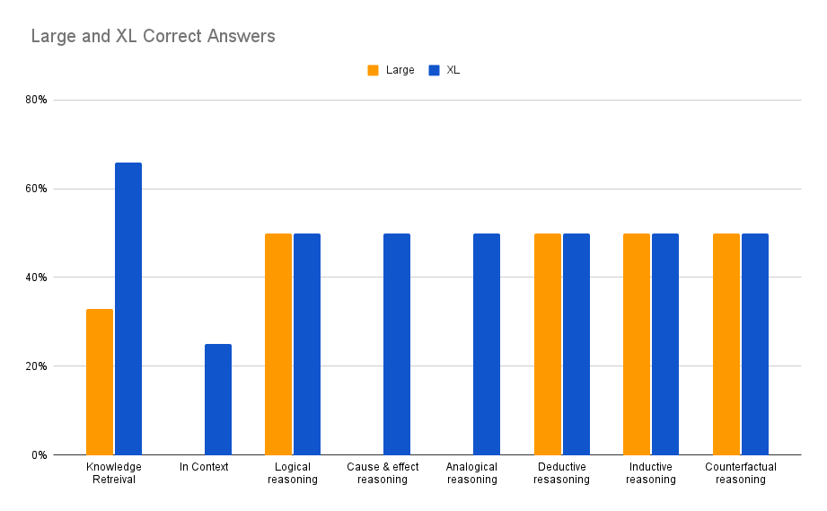

# Testing LLMs with LangChain in a local environment for (6) types of reasoning

Within (30) minutes of reading this post, you should be able to complete model serving requests from two variants of a popular python-based large language model (LLM) using LangChain on your local computer without requiring the connection or costs to an external 3rd party API server, such as HuggingFaceHub or OpenAI.  This exercise provides scripts that enable you to test these LLMs' capabilities in answering three prompt types i.e. knowledge retreival, six forms of reasoning questions and a long question with details in context.  After providing some details on the models and LangChain, we will walk your through installing dependencies, and we will review the code and the output of each model.   We will also provide side by side comparisons on model performance and processing times.  

Caveats and notes - Although you will not need a real-time connection to HuggingFace for model serving, you will need a connection to Huggingface to fetch code. Additionally, if you only have a few minutes and just want to run the models (and you have python3 i.e 3.11 and pip3 installed), you can proceed to [Step 1](#step-1---installing-dependencies-for-the-models-step1).

## Why run local

Some of the reasons why you may need to run your model locally, and not use an external API server, include:

* Security
    * You might want to fine tune the model and not post the derivative model on an external API server.
* Cost
    * You might want to avoid paying an external company for API calls. 
* Performance
    * You might need to manage your model's response times by using a private network and/or a specific server / processor type.
* Functionality
    * Your model might only run locally (i.e. Blenderbot, Meta's chatbot models).


## Large Language Models - Flan-T5-Large and Flan-T5-XL

In this blog, we will show the process to run the Flan-T5-Large and Flan-T5-XL models.   This family of transformer models, open sourced from Google, is designed for natural language processing tasks and provides both text-to-text and text generation capabilities, especially for question answering. 

The Flan-T5-Large version is based on the T5 (Text-To-Text Transfer Transformer) architecture and has 780M parameters.  This [paper](https://arxiv.org/pdf/2210.11416.pdf), which provides the following chart, claims that the Flan-T5-Large achieved a MMLU score of 45.1%, which is pretty good when compared to ChatGPT3's score of 43.9% (see page 10). It is a fairly popular model, which had 446,125 downloads last month. For more detailed information on this model’s background, performance and capabilities, please see this link on HuggingFaceHub, [https://huggingface.co/google/flan-t5-large](https://huggingface.co/google/flan-t5-large).  

The Flan-T5-xl version is based on the T5 (Text-To-Text Transfer Transformer) architecture and has 3B parameters.   It is a fairly popular model, which had 349,257 downloads last month. It achieved a MMLU score of 52%, which is better than T5-Large and ChatGPT3.  For more detailed information on this model’s background, performance and capabilities, please see this link on HuggingFaceHub, [https://huggingface.co/google/flan-t5-xl](https://huggingface.co/google/flan-t5-xl). 


## LangChain - What is it? Why use it?

The text in this section is from [https://python.LangChain.com/en/latest/index.html](https://python.langchain.com/en/latest/index.html) 

LangChain is a framework for developing applications powered by language models. We believe that the most powerful and differentiated applications will not only call out to a language model, but will also be:

1. _Data-aware_: connect a language model to other sources of data
2. _Agentic_: allow a language model to interact with its environment

The LangChain framework is designed around these principles.  This is the Python specific portion of the documentation. For a purely conceptual guide to LangChain, see [here](https://docs.langchain.com/docs/). For the JavaScript documentation, see [here](https://js.langchain.com/docs/). For concepts and terminology, please see [here](https://python.langchain.com/en/latest/getting_started/concepts.html).

## Modules

These modules are the core abstractions which we view as the building blocks of any LLM-powered application. For each module LangChain provides standard, extendable interfaces. LangChain also provides external integrations and even end-to-end implementations for off-the-shelf use. The docs for each module contain quickstart examples, how-to guides, reference docs, and conceptual guides.

The modules are (from least to most complex):

* [Models](https://python.langchain.com/en/latest/modules/models.html): Supported model types and integrations.
* [Prompts](https://python.langchain.com/en/latest/modules/prompts.html): Prompt management, optimization, and serialization.
* [Memory](https://python.langchain.com/en/latest/modules/memory.html): Memory refers to the state that is persisted between calls of a chain/agent.
* [Indexes](https://python.langchain.com/en/latest/modules/indexes.html): Language models become much more powerful when combined with application-specific data - this module contains interfaces and integrations for loading, querying and updating external data.
* [Chains](https://python.langchain.com/en/latest/modules/chains.html): Chains are structured sequences of calls (to an LLM or to a different utility).
* [Agents](https://python.langchain.com/en/latest/modules/agents.html): An agent is a Chain in which an LLM, given a high-level directive and a set of tools, repeatedly decides an action, executes the action and observes the outcome until the high-level directive is complete.
* [Callbacks](https://python.langchain.com/en/latest/modules/callbacks/getting_started.html): Callbacks let you log and stream the intermediate steps of any chain, making it easy to observe, debug, and evaluate the internals of an application.

## Use Cases

Best practices and built-in implementations for common LangChain use cases:

* [Autonomous Agents](https://python.langchain.com/en/latest/use_cases/autonomous_agents.html): Autonomous agents are long-running agents that take many steps in an attempt to accomplish an objective. Examples include AutoGPT and BabyAGI.
* [Agent Simulations](https://python.langchain.com/en/latest/use_cases/agent_simulations.html): Putting agents in a sandbox and observing how they interact with each other and react to events can be an effective way to evaluate their long-range reasoning and planning abilities.
* [Personal Assistants](https://python.langchain.com/en/latest/use_cases/personal_assistants.html): One of the primary LangChain use cases. Personal assistants need to take actions, remember interactions, and have knowledge about your data.
* [Question Answering](https://python.langchain.com/en/latest/use_cases/question_answering.html): Another common LangChain use case. Answering questions over specific documents, only utilizing the information in those documents to construct an answer.
* [Chatbots](https://python.langchain.com/en/latest/use_cases/chatbots.html): Language models love to chat, making this a very natural use of them.
* [Querying Tabular Data](https://python.langchain.com/en/latest/use_cases/tabular.html): Recommended reading if you want to use language models to query structured data (CSVs, SQL, dataframes, etc).
* [Code Understanding](https://python.langchain.com/en/latest/use_cases/code.html): Recommended reading if you want to use language models to analyze code.
* [Interacting with APIs](https://python.langchain.com/en/latest/use_cases/apis.html): Enabling language models to interact with APIs is extremely powerful. It gives them access to up-to-date information and allows them to take actions.
* [Extraction](https://python.langchain.com/en/latest/use_cases/extraction.html): Extract structured information from text.
* [Summarization](https://python.langchain.com/en/latest/use_cases/summarization.html): Compressing longer documents. A type of Data-Augmented Generation.
* [Evaluation](https://python.langchain.com/en/latest/use_cases/evaluation.html): Generative models are hard to evaluate with traditional metrics. One promising approach is to use language models themselves to do the evaluation.

As you can see, LangChain includes many advanced features and it enables complex model processing.   In our example, we will use models, prompts, and pipelines for question answering, text-to-text, sequence-to-sequence, and text-generation.

## Getting started

In our example and process, we wanted to simplify the getting started.   We selected specific LLMs to run in the LangChain framework, which will run in a local environment i.e. in an older, Mac laptop with a 1.6 GHz Dual-Core Intel Core i5 processor, 16GB RAM and no GPUs.   We anticipate that many developers can use this code and then modify our choices for your requirements.   

## Step 0

This post assumes that users have this software: a terminal emulator, Python3 and pip3.  For those that do not, the installation for that software can be found in the instructions below.   Before installing the software, you should consider which directories that you will use.  Most dependencies will install automatically.   You will need a directory for the python script that runs the models and we suggest a directory named t5pat.  If you know how to access your terminal and have a recent version of Python 3.x and pip3, then please skip to Step 1.

## Accessing your terminal

To access the terminal on a MacBook Air or any macOS device, you can follow these steps:

Click on the "Finder" icon in the Dock, which is typically located at the bottom of the screen.

In the Finder window, navigate to the "Applications" folder.

Inside the "Applications" folder, open the "Utilities" folder.

Look for an application called "Terminal" and double-click on it to launch the Terminal.

Alternatively, you can use Spotlight Search to quickly open the Terminal:

Press the "Command" key and the "Space" bar simultaneously to open Spotlight Search.

In the search field that appears, type "Terminal" and press "Return" or click on the "Terminal" application from the search results.

Once the Terminal is open, you will see a command-line interface where you can type commands and interact with the macOS command-line environment.

## Installing Python3

Installing Python on a Mac is relatively straightforward. Here's a step-by-step guide to help you:

Check the installed version (optional): Open the Terminal application (found in the Utilities folder within the Applications folder) and type python3 --version to see if Python is already installed on your system. Note that macOS usually comes with a pre-installed version of Python.

Download Python: Visit the official Python website at https://www.python.org/downloads/ and click on the "Download Python" button. Choose the latest stable version suitable for your macOS.

Run the installer: Locate the downloaded Python3 installer package (e.g., python-3.x.x-macosx11.x.pkg) and double-click on it to start the installation process. Follow the prompts and instructions in the installer.

Customize installation (optional): During the installation, you'll have the option to customize the installation settings. If you're unsure, the default settings are usually sufficient for most users.

Install Python: Proceed with the installation by clicking "Install" or a similar button. You may be prompted to enter your administrator password. Wait for the installation to complete.

Verify the installation: After the installation is finished, open a new Terminal window and type python3 --version to verify that Python is installed correctly. You should see the version number of the installed Python.

## Installing pip3

The pip package installer is usually bundled with Python by default. However, if you need to install or upgrade pip, you can follow these steps:

Open a terminal or command prompt on your system.

Check if you have Python installed by running the command the python3 --version. This will display the installed Python version. If Python is not installed, you need to install it before proceeding.

Once you have confirmed that Python3 is installed, you can proceed to install pip using the following command:

```
python3 -m ensurepip --upgrade
```

After running the command, pip should be installed or upgraded to the latest version.

To verify the installation, you can run pip3 --version to check if pip is installed correctly and display its version.

That's it! You should now have pip3 installed on your system.

## Step 1 - Installing dependencies for the models (#step1)

After installing the software above, you will need to install the dependencies.  From the terminal, please run the commands below

```
pip3 install transformers
pip3 install langchain
pip3 install torch
pip3 install matplotlib
```

## Build your python script, T5pat.py

After installing the dependencies, please build your python script.   In your terminal or code editor, please create a file, t5pat.py, in your directory i.e. t5pat, and cut and paste in following code into your t5pat.py file.

```
import time
import matplotlib.pyplot as plt
from langchain.llms import HuggingFacePipeline
from transformers import AutoTokenizer, AutoModelForSeq2SeqLM, pipeline

import os
# Disable parallelism and avoid the warning message
os.environ["TOKENIZERS_PARALLELISM"] = "false"

# Define model IDs
model_ids = ['google/flan-t5-large', 'google/flan-t5-xl']

# Define prompts and types
prompts = [
    'What is the capital of Germany?',
    'What is the capital of Spain?',
    'What is the capital of Canada?',
    'What is the next number in the sequence: 2, 4, 6, 8, ...? If all cats have tails, and Fluffy is a cat, does Fluffy have a tail?',
    'If you eat too much junk food, what will happen to your health? How does smoking affect the risk of lung cancer?',
    'In the same way that pen is related to paper, what is fork related to? If tree is related to forest, what is brick related to?',
    'Every time John eats peanuts, he gets a rash. Does John have a peanut allergy? Every time Sarah studies for a test, she gets an A. Will Sarah get an A on the next test if she studies?',
    'All dogs have fur. Max is a dog. Does Max have fur? If it is raining outside, and Mary does not like to get wet, will Mary take an umbrella?',
    'If I had studied harder, would I have passed the exam? What would have happened if Thomas Edison had not invented the light bulb?',
    'The center of Tropical Storm Arlene, at 02/1800 UTC, is near 26.7N 86.2W. This position is about 425 km/230 nm to the west of Fort Myers in Florida, and it is about 550 km/297 nm to the NNW of the western tip of Cuba. The tropical storm is moving southward, or 175 degrees, 4 knots. The estimated minimum central pressure is 1002 mb. The maximum sustained wind speeds are 35 knots with gusts to 45 knots. The sea heights that are close to the tropical storm are ranging from 6 feet to a maximum of 10 feet.  Precipitation: scattered to numerous moderate is within 180 nm of the center in the NE quadrant. Isolated moderate is from 25N to 27N between 80W and 84W, including parts of south Florida.  Broad surface low pressure extends from the area of the tropical storm, through the Yucatan Channel, into the NW part of the Caribbean Sea.   Where and when will the storm make landfall?'
]

types = [
    'Knowledge Retrieval',
    'Knowledge Retrieval',
    'Knowledge Retrieval',
    'Logical Reasoning',
    'Cause and Effect',
    'Analogical Reasoning',
    'Inductive Reasoning',
    'Deductive Reasoning',
    'Counterfactual Reasoning',
    'In Context'
]

# Create empty lists to store generation times, model load times, tokenizer load times, and pipeline load times
xl_generation_times = []
large_generation_times = []

xl_model_load_times = []
large_model_load_times = []

xl_tokenizer_load_times = []
large_tokenizer_load_times = []

xl_pipeline_load_times = []
large_pipeline_load_times = []

prompt_types = []

for model_id in model_ids:
    # Load tokenizer
    tokenizer_start_time = time.time()
    tokenizer = AutoTokenizer.from_pretrained(model_id)
    tokenizer_end_time = time.time()

    # Load model
    model_start_time = time.time()
    model = AutoModelForSeq2SeqLM.from_pretrained(model_id)
    model_end_time = time.time()

    # Load pipeline
    pipe_start_time = time.time()
    pipe = pipeline("text2text-generation", model=model, tokenizer=tokenizer, max_length=512)
    local_llm = HuggingFacePipeline(pipeline=pipe)
    pipe_end_time = time.time()

    # Store loading times
    if model_id == 'google/flan-t5-large':
        large_model_load_times.append(model_end_time - model_start_time)
        large_tokenizer_load_times.append(tokenizer_end_time - tokenizer_start_time)
        large_pipeline_load_times.append(pipe_end_time - pipe_start_time)
    elif model_id == 'google/flan-t5-xl':
        xl_model_load_times.append(model_end_time - model_start_time)
        xl_tokenizer_load_times.append(tokenizer_end_time - tokenizer_start_time)
        xl_pipeline_load_times.append(pipe_end_time - pipe_start_time)

    # Print model results
    print()
    print(f"Results for model: {model_id}")
    print("=" * 30)

    # Knowledge retrieval examples
    for i, prompt in enumerate(prompts):
        start_time = time.time()
        answer = local_llm(prompt)
        end_time = time.time()
        print(f"Prompt: {prompt}")
        print(f"Answer: {answer}")
        print(f"Generation Time: {end_time - start_time:.5f} seconds")
        print(f"Type: {types[i]}")
        print()

        prompt_types.append(types[i])  # Store the prompt type

        if model_id == 'google/flan-t5-large':
            large_generation_times.append(end_time - start_time)
        elif model_id == 'google/flan-t5-xl':
            xl_generation_times.append(end_time - start_time)

    print(f"Loading times for model {model_id}")
    print("Tokenizer Loading Time:", f"{tokenizer_end_time - tokenizer_start_time:.5f}", "seconds")
    print("Model Loading Time:", f"{model_end_time - model_start_time:.5f}", "seconds")
    print("Pipeline Loading Time:", f"{pipe_end_time - pipe_start_time:.5f}", "seconds\n\n")


# Plot model load times
model_load_times = [sum(xl_model_load_times), sum(large_model_load_times)]
model_labels = ['XL Model', 'Large Model']

plt.figure(figsize=(18, 6))
plt.subplot(131)
plt.bar(model_labels, model_load_times, color=['blue', 'orange'])
plt.ylabel('Load Time (seconds)')
plt.xlabel('Model')
plt.title('Model Load Time Comparison')

# Plot tokenizer load times
tokenizer_load_times = [sum(xl_tokenizer_load_times), sum(large_tokenizer_load_times)]

plt.subplot(132)
plt.bar(model_labels, tokenizer_load_times, color=['blue', 'orange'])
plt.ylabel('Load Time (seconds)')
plt.xlabel('Model')
plt.title('Tokenizer Load Time Comparison')

# Plot pipeline load times
pipeline_load_times = [sum(xl_pipeline_load_times), sum(large_pipeline_load_times)]
plt.subplot(133)
plt.bar(model_labels, pipeline_load_times, color=['blue', 'orange'])
plt.ylabel('Load Time (seconds)')
plt.xlabel('Model')
plt.title('Pipeline Load Time Comparison')

# Plot generation times
plt.figure(figsize=(9, 6))
plt.barh(range(len(types)), xl_generation_times, height=0.4, align='center', color='blue', label='XL Model')
plt.barh([x + 0.4 for x in range(len(types))], large_generation_times, height=0.4, align='center', color='orange', alpha=0.5, label='Large Model')
plt.yticks(range(len(types)), types)
plt.ylabel('Type')
plt.xlabel('Generation Time (seconds)')
plt.title('Generation Time Comparison')
plt.legend()

plt.tight_layout()
plt.show()

```

## Run your script

To run your script, please open your terminal to the directory that holds the file, i.e. t5pat.   Then run the following statement:

```
python3 t5pat.py
````


## Sample script output

The following provides sample model output from running the script.  The script has a text output followed by four charts.  You can save the charts using the file button on the chart displays or just close them out.  Either action will release the script and bring your back to the terminal prompt.

```

Results for model: google/flan-t5-large
==============================
Prompt: What is the capital of Germany?
Answer: berlin
Generation Time: 1.06194 seconds
Type: Knowledge Retrieval

Prompt: What is the capital of Spain?
Answer: turin
Generation Time: 0.73172 seconds
Type: Knowledge Retrieval

Prompt: What is the capital of Canada?
Answer: toronto
Generation Time: 1.12487 seconds
Type: Knowledge Retrieval

Prompt: What is the next number in the sequence: 2, 4, 6, 8, ...? If all cats have tails, and Fluffy is a cat, does Fluffy have a tail?
Answer: yes
Generation Time: 1.08774 seconds
Type: Logical Reasoning

Prompt: If you eat too much junk food, what will happen to your health? How does smoking affect the risk of lung cancer?
Answer: no
Generation Time: 0.69614 seconds
Type: Cause and Effect

Prompt: In the same way that pen is related to paper, what is fork related to? If tree is related to forest, what is brick related to?
Answer: brick is related to brick
Generation Time: 1.51508 seconds
Type: Analogical Reasoning

Prompt: Every time John eats peanuts, he gets a rash. Does John have a peanut allergy? Every time Sarah studies for a test, she gets an A. Will Sarah get an A on the next test if she studies?
Answer: yes
Generation Time: 1.24550 seconds
Type: Inductive Reasoning

Prompt: All dogs have fur. Max is a dog. Does Max have fur? If it is raining outside, and Mary does not like to get wet, will Mary take an umbrella?
Answer: yes
Generation Time: 1.28181 seconds
Type: Deductive Reasoning

Prompt: If I had studied harder, would I have passed the exam? What would have happened if Thomas Edison had not invented the light bulb?
Answer: no one would have invented the light bulb
Generation Time: 2.15294 seconds
Type: Counterfactual Reasoning

Prompt: The center of Tropical Storm Arlene, at 02/1800 UTC, is near 26.7N 86.2W. This position is about 425 km/230 nm to the west of Fort Myers in Florida, and it is about 550 km/297 nm to the NNW of the western tip of Cuba. The tropical storm is moving southward, or 175 degrees, 4 knots. The estimated minimum central pressure is 1002 mb. The maximum sustained wind speeds are 35 knots with gusts to 45 knots. The sea heights that are close to the tropical storm are ranging from 6 feet to a maximum of 10 feet.  Precipitation: scattered to numerous moderate is within 180 nm of the center in the NE quadrant. Isolated moderate is from 25N to 27N between 80W and 84W, including parts of south Florida.  Broad surface low pressure extends from the area of the tropical storm, through the Yucatan Channel, into the NW part of the Caribbean Sea.   Where and when will the storm make landfall?
Answer: about 425 km/230 nm to the west of Fort Myers in Florida, and it is about 550 km/297 nm to the NNW of the western tip of Cuba
Generation Time: 10.67541 seconds
Type: In Context

Loading times for model google/flan-t5-large
Tokenizer Loading Time: 0.94174 seconds
Model Loading Time: 17.28348 seconds
Pipeline Loading Time: 0.11213 seconds


Loading checkpoint shards: 100%|██████████████████| 2/2 [01:38<00:00, 49.17s/it]

Results for model: google/flan-t5-xl
==============================
Prompt: What is the capital of Germany?
Answer: berlin
Generation Time: 43.58305 seconds
Type: Knowledge Retrieval

Prompt: What is the capital of Spain?
Answer: santander
Generation Time: 2.80783 seconds
Type: Knowledge Retrieval

Prompt: What is the capital of Canada?
Answer: ottawa
Generation Time: 3.06489 seconds
Type: Knowledge Retrieval

Prompt: What is the next number in the sequence: 2, 4, 6, 8, ...? If all cats have tails, and Fluffy is a cat, does Fluffy have a tail?
Answer: yes
Generation Time: 2.89040 seconds
Type: Logical Reasoning

Prompt: If you eat too much junk food, what will happen to your health? How does smoking affect the risk of lung cancer?
Answer: It increases the risk of developing lung cancer.
Generation Time: 5.07974 seconds
Type: Cause and Effect

Prompt: In the same way that pen is related to paper, what is fork related to? If tree is related to forest, what is brick related to?
Answer: building
Generation Time: 2.60167 seconds
Type: Analogical Reasoning

Prompt: Every time John eats peanuts, he gets a rash. Does John have a peanut allergy? Every time Sarah studies for a test, she gets an A. Will Sarah get an A on the next test if she studies?
Answer: yes
Generation Time: 3.53700 seconds
Type: Inductive Reasoning

Prompt: All dogs have fur. Max is a dog. Does Max have fur? If it is raining outside, and Mary does not like to get wet, will Mary take an umbrella?
Answer: yes
Generation Time: 2.90499 seconds
Type: Deductive Reasoning

Prompt: If I had studied harder, would I have passed the exam? What would have happened if Thomas Edison had not invented the light bulb?
Answer: the world would be dark
Generation Time: 3.81147 seconds
Type: Counterfactual Reasoning

Prompt: The center of Tropical Storm Arlene, at 02/1800 UTC, is near 26.7N 86.2W. This position is about 425 km/230 nm to the west of Fort Myers in Florida, and it is about 550 km/297 nm to the NNW of the western tip of Cuba. The tropical storm is moving southward, or 175 degrees, 4 knots. The estimated minimum central pressure is 1002 mb. The maximum sustained wind speeds are 35 knots with gusts to 45 knots. The sea heights that are close to the tropical storm are ranging from 6 feet to a maximum of 10 feet.  Precipitation: scattered to numerous moderate is within 180 nm of the center in the NE quadrant. Isolated moderate is from 25N to 27N between 80W and 84W, including parts of south Florida.  Broad surface low pressure extends from the area of the tropical storm, through the Yucatan Channel, into the NW part of the Caribbean Sea.   Where and when will the storm make landfall?
Answer: Fort Myers in Florida
Generation Time: 14.06618 seconds
Type: In Context

Loading times for model google/flan-t5-xl
Tokenizer Loading Time: 0.54048 seconds
Model Loading Time: 131.81162 seconds
Pipeline Loading Time: 0.57841 seconds
```


## Detailed review of the code blocks

The following provides a review of the code blocks:

### Importing the necessary dependencies:

```
import time
import matplotlib.pyplot as plt
from langchain.llms import HuggingFacePipeline
from transformers import AutoTokenizer, AutoModelForSeq2SeqLM, pipeline
```
The first line imports time, which we use to measure the generation time of each pipeline amd the load times for the model, pipelines and tokeneizers.
The second line imports matplotlib.pyploy as plt, which is used for the chart generations.
The next line imports HuggingFacePipeline from langchain.llms. The next line imports AutoTokenizer, AutoModelForSeq2SeqLM, pipeline from transformer.

```
import os
# disable parallelism and avoid the warning message
os.environ["TOKENIZERS_PARALLELISM"] = "false"
# Redirect stderr to /dev/null
os.system("python t5pat20.py 2>/dev/null")
```
Import the OS package and use the os.environ and os.system methods to disable parallelism and to redirect stderr, which suppresses the warning messages in the output. 

### Load models and pipelines

```
# Define model IDs
model_ids = ['google/flan-t5-large', 'google/flan-t5-xl']
```
This line defines a list called model_ids containing the IDs of the models that will be used in the script for inference.  The list has two model ids, 'google/flan-t5-large' and 'google/flan-t5-xl'.

### Define prompts in a list

This statement creates a list called prompt with each prompt provided as a text string.

```
# Define prompts and types
prompts = [
    'What is the capital of Germany?',
    'What is the capital of Spain?',
    'What is the capital of Canada?',
    'What is the next number in the sequence: 2, 4, 6, 8, ...? If all cats have tails, and Fluffy is a cat, does Fluffy have a tail?',
    'If you eat too much junk food, what will happen to your health? How does smoking affect the risk of lung cancer?',
    'In the same way that pen is related to paper, what is fork related to? If tree is related to forest, what is brick related to?',
    'Every time John eats peanuts, he gets a rash. Does John have a peanut allergy? Every time Sarah studies for a test, she gets an A. Will Sarah get an A on the next test if she studies?',
    'All dogs have fur. Max is a dog. Does Max have fur? If it is raining outside, and Mary does not like to get wet, will Mary take an umbrella?',
    'If I had studied harder, would I have passed the exam? What would have happened if Thomas Edison had not invented the light bulb?',
    'The center of Tropical Storm Arlene, at 02/1800 UTC, is near 26.7N 86.2W. This position is about 425 km/230 nm to the west of Fort Myers in Florida, and it is about 550 km/297 nm to the NNW of the western tip of Cuba. The tropical storm is moving southward, or 175 degrees, 4 knots. The estimated minimum central pressure is 1002 mb. The maximum sustained wind speeds are 35 knots with gusts to 45 knots. The sea heights that are close to the tropical storm are ranging from 6 feet to a maximum of 10 feet.  Precipitation: scattered to numerous moderate is within 180 nm of the center in the NE quadrant. Isolated moderate is from 25N to 27N between 80W and 84W, including parts of south Florida.  Broad surface low pressure extends from the area of the tropical storm, through the Yucatan Channel, into the NW part of the Caribbean Sea.   Where and when will the storm make landfall?'
]
```
### Defiine each prompt type in a list

This statement creates a list called prompt type with each prompt type provided as a text string.

```
types = [
    'Knowledge Retrieval',
    'Knowledge Retrieval',
    'Knowledge Retrieval',
    'Logical Reasoning',
    'Cause and Effect',
    'Analogical Reasoning',
    'Inductive Reasoning',
    'Deductive Reasoning',
    'Counterfactual Reasoning',
    'In Context'
]
```
### Create empty lists to store generation, load times and prompt_types for the XL and Large models.

These lists will be used appended to later in the script as an answer to each question is generated by each model.   

```
xl_generation_times = []
large_generation_times = []

xl_model_load_times = []
large_model_load_times = []

xl_tokenizer_load_times = []
large_tokenizer_load_times = []

xl_pipeline_load_times = []
large_pipeline_load_times = []

prompt_types = []
```

### Load tokenizer and model

Each line is detailed following the code block.

```
for model_id in model_ids:
    # Load tokenizer
    tokenizer_start_time = time.time()
    tokenizer = AutoTokenizer.from_pretrained(model_id)
    tokenizer_end_time = time.time()

    # Load model
    model_start_time = time.time()
    model = AutoModelForSeq2SeqLM.from_pretrained(model_id)
    model_end_time = time.time()

    # Load pipeline
    pipe_start_time = time.time()
    pipe = pipeline("text2text-generation", model=model, tokenizer=tokenizer, max_length=512)
    local_llm = HuggingFacePipeline(pipeline=pipe)
    pipe_end_time = time.time()
```
for model_id in model_ids: This line starts a loop that iterates over each model ID in the model_ids list.

tokenizer_start_time = time.time(): sets the tokenizer_start_time to the currrent time

tokenizer = AutoTokenizer.from_pretrained(model_id): This line loads the tokenizer for the current model ID. The AutoTokenizer.from_pretrained method is used to automatically download and instantiate the tokenizer associated with the given model ID.

tokenizer_end_time = time.time(): sets the tokenizer_end_time to the currrent time

model_start_time = time.time(): sets the model_start_time to the current time

model = AutoModelForSeq2SeqLM.from_pretrained(model_id): This line loads the model for the current model ID. The AutoModelForSeq2SeqLM.from_pretrained method is used to automatically download and instantiate the model associated with the given model ID.

model_end_time = time.time(): sets the model_end_time to the current time

pipe_start_time = time.time(): sets the pipe_start_time to the current time

pipe = pipeline("text2text-generation", model=model, tokenizer=tokenizer, max_length=512): This line creates a pipeline for text-to-text generation using the loaded tokenizer and model. The pipeline is configured with the model and tokenizer objects, as well as a maximum length of 512 tokens.

local_llm = HuggingFacePipeline(pipeline=pipe): This line creates an instance of the HuggingFacePipeline class, which is a wrapper around the Hugging Face pipeline. It takes the pipeline object created in the previous step as an argument.

pipe_end_time = time.time(): sets the pipe_end_time to the current time

### Store the loading time
```
    # Store loading times
    if model_id == 'google/flan-t5-large':
        large_model_load_times.append(model_end_time - model_start_time)
        large_tokenizer_load_times.append(tokenizer_end_time - tokenizer_start_time)
        large_pipeline_load_times.append(pipe_end_time - pipe_start_time)
    elif model_id == 'google/flan-t5-xl':
        xl_model_load_times.append(model_end_time - model_start_time)
        xl_tokenizer_load_times.append(tokenizer_end_time - tokenizer_start_time)
        xl_pipeline_load_times.append(pipe_end_time - pipe_start_time)
```
After calculating the time to load using end minus start, use the append method to store the loading times in the appropriate list based upon the model name.

Now print the model output startign with a header that identifies the model name.
```
    # Print model results
    print()
    print(f"Results for model {model_id}")
    print("=" * 30)
```
print(): prints a new line

print(f"Results for model {model_id}"): This line prints the model ID to indicate the current model being used.

print("=" * 30): This line prints a line of equal signs for visual separation.

### Prompt processsing

Each line is defined after the code block.

```
 # Prompt processing
    for i, prompt in enumerate(prompts):
        start_time = time.time()
        answer = local_llm(prompt)
        end_time = time.time()
        print(f"Prompt: {prompt}")
        print(f"Answer: {answer}")
        print(f"Generation Time: {end_time - start_time:.5f} seconds")
        print(f"Type: {types[i]}")
        print()

        prompt_types.append(types[i])  # Store the prompt type
```

for i, prompt in enumerate(prompts): This line initiates a loop that iterates over the prompts list and assigns each element to the variable prompt. The enumerate() function is used to retrieve both the index (i) and the value (prompt) of each element in the list.

start_time = time.time(): This line records the current time as the start time of the generation process. It uses the time module's time() function, which returns the current time in seconds since the epoch.

answer = local_llm(prompt): This line generates the answer for the given prompt using the local_llm pipeline. It calls the pipeline with the prompt as an argument and assigns the generated answer to the variable answer.

end_time = time.time(): This line records the current time as the end time of the generation process, right after generating the answer.

print(f"Prompt: {prompt}"): This line prints the original prompt that was used for generating the answer.

print(f"Answer: {answer}"): This line prints the generated answer.

print(f"Generation Time: {end_time - start_time:.5f} seconds"): This line calculates the duration of the generation process by subtracting the start time from the end time. It then prints the generation time with five decimal places.

print(f"Type: {types[i]}"):This line prints the corresponding type of the prompt from the types list using the current index i.

prompt_types.append(types[i]): This line appends the type of the prompt (types[i]) to the prompt_types list, which is used to store the prompt types for later use or analysis.

### Save model generation times

```
      if model_id == 'google/flan-t5-large':
            large_generation_times.append(end_time - start_time)
        elif model_id == 'google/flan-t5-xl':
            xl_generation_times.append(end_time - start_time)
```
The "if model_id" line checks if the current model being used is the large model.  If the current model is the large model, the next line appends the duration of the generation process (end time minus start time) to the large_generation_times list.

This "elif model_id" line checks if the current model being used is the XL model. If the current model is the XL model, the last line appends the duration of the generation process (end time minus start time) to the xl_generation_times list.

### Print loading time 

The following prints the loading times for the models, tokenizers and pipelines.  The description fo these lines follows the code.

```
    print(f"Loading times for model {model_id}")
    print("Model Loading Time:", f"{model_end_time - model_start_time:.5f}", "seconds")
    print("Tokenizer Loading Time:", f"{tokenizer_end_time - tokenizer_start_time:.5f}", "seconds")
    print("Pipeline Loading Time:", f"{pipe_end_time - pipe_start_time:.5f}", "seconds\n\n")
```
print(f"Loading times for model {model_id}"): This prints a header with the model id

print("Tokenizer Loading Time:", f"{tokenizer_end_time - tokenizer_start_time:.5f}", "seconds"): This prints the tokenizer loading time in seconds.

print("Model Loading Time:", f"{model_end_time - model_start_time:.5f}", "seconds"): This prints the model loading time in seconds.

print("Pipeline Loading Time:", f"{pipe_end_time - pipe_start_time:.5f}", "seconds\n\n"): This prints the pipeline loading time is seconds.

### Plots for generation and loading times

The script uses matplotlib to plot 4 charts in two figures, which are named, Figure_1 and Figure_2.

Let's look at the details on the loading times for the model, tokenizer and pipeline.

```
# Plot model load times
model_load_times = [sum(xl_model_load_times), sum(large_model_load_times)]
model_labels = ['XL Model', 'Large Model']

plt.figure(figsize=(18, 6))
plt.subplot(131)
plt.bar(model_labels, model_load_times, color=['blue', 'orange'])
plt.ylabel('Load Time (seconds)')
plt.xlabel('Model')
plt.title('Model Load Time Comparison')

```
Model Load Time Comparison: model_load_times = [sum(xl_model_load_times), sum(large_model_load_times)]: This line calculates the total model load times for the XL model and large model by summing up the individual load times. 

model_labels = ['XL Model', 'Large Model']: This line defines the labels for the model load time chart.

plt.subplot(132): This line selects the second subplot for the model load time comparison chart.

plt.bar(model_labels, model_load_times, color=['blue', 'orange']): This line creates a vertical bar chart (bar) with the model load times (model_load_times). The bars are assigned the colors blue and orange, corresponding to the XL model and large model, respectively.

plt.ylabel('Load Time (seconds)'): This line sets the y-axis label as 'Load Time (seconds)'.

plt.xlabel('Model'): This line sets the x-axis label as 'Model'.

plt.title('Model Load Time Comparison'): This line sets the title of the chart as 'Model Load Time Comparison'.
```
# Plot tokenizer load times
tokenizer_load_times = [sum(xl_tokenizer_load_times), sum(large_tokenizer_load_times)]

plt.subplot(132)
plt.bar(model_labels, tokenizer_load_times, color=['blue', 'orange'])
plt.ylabel('Load Time (seconds)')
plt.xlabel('Model')
plt.title('Tokenizer Load Time Comparison')
```
### Tokenizer Load Time Comparison:

tokenizer_load_times = [sum(xl_tokenizer_load_times), sum(large_tokenizer_load_times)]: This line calculates the total tokenizer load times for the XL model and large model by summing up the individual load times.

plt.subplot(133): This line selects the third subplot for the tokenizer load time comparison chart.

plt.bar(model_labels, tokenizer_load_times, color=['blue', 'orange']): This line creates a vertical bar chart with the tokenizer load times (tokenizer_load_times). The bars are assigned the colors blue and orange, corresponding to the XL model and large model, respectively.

plt.ylabel('Load Time (seconds)'): This line sets the y-axis label as 'Load Time (seconds)'.

plt.xlabel('Model'): This line sets the x-axis label as 'Model'.

plt.title('Tokenizer Load Time Comparison'): This line sets the title of the chart as 'Tokenizer Load Time Comparison'.

```
# Plot pipeline load times
pipeline_load_times = [sum(xl_pipeline_load_times), sum(large_pipeline_load_times)]
plt.subplot(133)
plt.bar(model_labels, pipeline_load_times, color=['blue', 'orange'])
plt.ylabel('Load Time (seconds)')
plt.xlabel('Model')
plt.title('Pipeline Load Time Comparison')
```
Pipeline Load Time Comparison: pipeline_load_times = [sum(xl_pipeline_load_times), sum(large_pipeline_load_times)]: This line calculates the total pipeline load times for the XL model and large model by summing up the individual load times.

plt.figure(figsize=(8, 6)): This line creates a new figure with a specific size (8 inches wide and 6 inches tall) to accommodate the pipeline load time comparison chart.

plt.bar(model_labels, pipeline_load_times, color=['blue', 'orange']): This line creates a vertical bar chart with the pipeline load times (pipeline_load_times). The bars are assigned the colors blue and orange, corresponding to the XL model and large model, respectively.

plt.ylabel('Load Time (seconds)'): This line sets the y-axis label as 'Load Time (seconds)'.

plt.xlabel('Model'): This line sets the x-axis label as 'Model'.

plt.title('Pipeline Load Time Comparison'): This line sets the title of the chart as 'Pipeline Load Time Comparison'.

```
# Plot generation times
plt.figure(figsize=(9, 6))
plt.barh(range(len(types)), xl_generation_times, height=0.4, align='center', color='blue', label='XL Model')
plt.barh([x + 0.4 for x in range(len(types))], large_generation_times, height=0.4, align='center', color='orange', alpha=0.5, label='Large Model')
plt.yticks(range(len(types)), types)
plt.ylabel('Type')
plt.xlabel('Generation Time (seconds)')
plt.title('Generation Time Comparison')
plt.legend()

plt.tight_layout()
plt.show()
```
### Pipeline Generation Time Comparison:

This code plots the generation times of the pipelines for each prompt in a chart, which is called Figure_2.  Like Figure_1, Figure_2 can be saved or dismissed and the script will continue, complete and take you back to your terminal prompt.    

plt.figure(figsize=(9, 6)): This line creates a new figure with a specific size (18 inches wide and 6 inches tall) to accommodate the generation time comparison chart.

plt.barh(range(len(types)), xl_generation_times, height=0.4, align='center', color='blue', label='XL Model'): This line creates a horizontal bar chart (barh) with the XL model's generation times (xl_generation_times) and assigns the color blue to the bars. Each bar represents a different prompt type, and the height and alignment of the bars are set accordingly. The label 'XL Model' is provided for the legend.

plt.barh([x + 0.4 for x in range(len(types))], large_generation_times, height=0.4, align='center', color='orange', alpha=0.5, label='Large Model'): This line creates another set of horizontal bars for the large model's generation times (large_generation_times). The bars are shifted by 0.4 units horizontally compared to the XL model bars to avoid overlap. The bars are assigned the color orange and an alpha value of 0.5 (partially transparent). The label 'Large Model' is provided for the legend.

plt.yticks(range(len(types)), types): This line sets the y-axis ticks to the prompt types (types), which are positioned at the corresponding indices.

plt.ylabel('Type'): This line sets the y-axis label as 'Type'.

plt.xlabel('Generation Time (seconds)'): This line sets the x-axis label as 'Generation Time (seconds)'.

plt.title('Generation Time Comparison'): This line sets the title of the chart as 'Generation Time Comparison'.

plt.legend(): This line adds a legend to the chart, which shows the labels and corresponding colors for the XL model and large model bars.

plt.tight_layout(): This line adjusts the spacing between subplots to prevent overlapping labels and titles.

plt.show(): This line displays all the created charts on the screen.


## Review of the script's output and performance

For each model, the script prints text output for each prompt including the prompt, answer, generation time and prompt type.   It provides a text output on the loading times for the model, tokenizer and pipeline times.   It produces charts for generation time for each prompt type and load times for the model, tokenizer and pipeline.   In our tests, the XL model took significantly longer in all aspects than the Large model, but the XL model answered more questions correctly.

 Neither model did a good job with prompts that contained two questions and both models mostly answered the second question and ignored the 1st question.    The answers did not provide much context, although we did not ask for context.   Determining what is correct or incorrect for a reasoning question could have some subjectivity.    The XL was stronger than the Large model on knowledge retreival, in context, cause and effect, and analogical reasoning.  The XL did not perform well initially on analogical or counterfactual questions but its answers improved as we ran more epochs.   

The following table provides a summary of the models' correct answers.  We recognize that the format of the prompts, especially asking two questions in one prompt, can impact the model.   We used these more complex examples as they might reflect human interaction.  As you can see, the model's performance can vary depending on the question type and the prompt construction.   This is to be expected and could be fine tuned, which is a potential topic for follow-on discussions and/or further experimentations.



For reference, we are provided the plots which show the model generation as well as the loading times for the models, tokenizers and pipelines.


### Summary for Large model

Each of the answers did not answer the first question.   The answers did not provide much context, although we did not ask for context in the answer.   Determinining what is correct or incorrect for a reasoning question could have some subjectivity.

Let's look at the output for the Large model's output in the pipeline. This chart provides the question types, the correctness of the answer, and the time required to generate the pipelines answers.

| Prompt| Correct | Time in sec |
| --- | --- | --- |
| Knowledge retrieval | 100%| 1.1 |
| Knowledge retrieval |   0%| 0.7 |
| Knowledge retrieval |   0%| 1.1 |
| Logical Reasoning | 50% | 1.1 | 
| Cause Effect Reasoning | 0% | 0.7 |
| Analogical Reasoning | 0%| 1.5 |
| Inductive Reasoning | 50% | 1.2 |
| Deductive Reasoning | 50%| 1.3 |
| Counterfactual Reasoning | 50% | 2.2 |
| In Context | 0%| 10.7 |

Now, let’s examine the results of the flan-t5-large model for knowledge retreival.  

```
Results for model: google/flan-t5-large
==============================
Prompt: What is the capital of Germany?
Answer: berlin
Generation Time: 1.06194 seconds
Type: Knowledge Retrieval

Prompt: What is the capital of Spain?
Answer: turin
Generation Time: 0.73172 seconds
Type: Knowledge Retrieval

Prompt: What is the capital of Canada?
Answer: toronto
Generation Time: 1.12487 seconds
Type: Knowledge Retrieval

```
The model provided answers to three questions on the capitals of Germany, Spain and Canada.  Generated answers: The lines berlin, turin, and toronto represent the generated answers for the given input prompts: "What is the capital of Germany?", "What is the capital of Spain?", and "What is the capital of Canada?" respectively. These answers are produced by the flan_t5_large model used in the HuggingFacePipeline.

The model answered 2 of the 3 questions incorrectly.  When reviewing the incorrect answers, the model did answer with cities in the correct country, just not the capital.

Berlin (correct)

Turin (wrong, it's Madrid)

Toronto (wrong, it's Ottowa)

Generation Time: The generation times vary from 0.72 to 0.79 seconds.   These are very similar.

### Question Answer with Reasoning Examples - output review

The following provides analysis of the output of the Question Answer with Reasoning examples:

```
Prompt: What is the next number in the sequence: 2, 4, 6, 8, ...? If all cats have tails, and Fluffy is a cat, does Fluffy have a tail?
Answer: yes
Generation Time: 1.08774 seconds
Type: Logical Reasoning

Prompt: If you eat too much junk food, what will happen to your health? How does smoking affect the risk of lung cancer?
Answer: no
Generation Time: 0.69614 seconds
Type: Cause and Effect

Prompt: In the same way that pen is related to paper, what is fork related to? If tree is related to forest, what is brick related to?
Answer: brick is related to brick
Generation Time: 1.51508 seconds
Type: Analogical Reasoning

Prompt: Every time John eats peanuts, he gets a rash. Does John have a peanut allergy? Every time Sarah studies for a test, she gets an A. Will Sarah get an A on the next test if she studies?
Answer: yes
Generation Time: 1.24550 seconds
Type: Inductive Reasoning

Prompt: All dogs have fur. Max is a dog. Does Max have fur? If it is raining outside, and Mary does not like to get wet, will Mary take an umbrella?
Answer: yes
Generation Time: 1.28181 seconds
Type: Deductive Reasoning

Prompt: If I had studied harder, would I have passed the exam? What would have happened if Thomas Edison had not invented the light bulb?
Answer: no one would have invented the light bulb
Generation Time: 2.15294 seconds
Type: Counterfactual Reasoning
```
Each of the answers did not answer the first question.   The answers did not provide much context, although we did not ask for context in the answer.   Determinining what is correct or incorrect for a reasoning question could have some subjectivity.


The last question tests providing several lines of content in the prompt along with the question being asked.   We label this as as an "in-context" type prompt.   The model's response to this prompt extracts relevant information from the context provided but it does not answer the question correctly regarding the place or time of the storm's landfall.

```
Prompt: The center of Tropical Storm Arlene, at 02/1800 UTC, is near 26.7N 86.2W. This position is about 425 km/230 nm to the west of Fort Myers in Florida, and it is about 550 km/297 nm to the NNW of the western tip of Cuba. The tropical storm is moving southward, or 175 degrees, 4 knots. The estimated minimum central pressure is 1002 mb. The maximum sustained wind speeds are 35 knots with gusts to 45 knots. The sea heights that are close to the tropical storm are ranging from 6 feet to a maximum of 10 feet.  Precipitation: scattered to numerous moderate is within 180 nm of the center in the NE quadrant. Isolated moderate is from 25N to 27N between 80W and 84W, including parts of south Florida.  Broad surface low pressure extends from the area of the tropical storm, through the Yucatan Channel, into the NW part of the Caribbean Sea.   Where and when will the storm make landfall?
Answer: about 425 km/230 nm to the west of Fort Myers in Florida, and it is about 550 km/297 nm to the NNW of the western tip of Cuba
Generation Time: 10.67541 seconds
Type: In Context
```

As you can see, the model's performance can vary depending on the question type.   This is to be expected. 

```
Loading times for model google/flan-t5-large
Tokenizer Loading Time: 0.94174 seconds
Model Loading Time: 17.28348 seconds
Pipeline Loading Time: 0.11213 seconds

```

The loading times show that flan-t5-large model takes 16.6 seconds, whereas the tokenizer takes .24 seconds and the Pipeline loading is shortest at 0.08 seconds.

Now, let's examine the results of the flan-t5-xl model. The information message below is printed as the script loads checkpoint shards as part of initializing the model and tokenizer.  

```
Loading checkpoint shards: 100%|██████████████████| 2/2 [01:38<00:00, 49.17s/it]
```
Next let's look at the output for the XL model's output in the pipeline. This chart provides the question types, the correctness of the answer, and the time required to generate the pipelines answers.

| Prompt| Correct | Time in sec |
| --- | --- | --- |
| Knowledge retrieval | 100%| 43.6 |
| Knowledge retrieval |   0%| 2.8 |
| Knowledge retrieval | 100%| 3.1 |
| Logical Reasoning | 50% | 2.9 | 
| Cause Effect Reasoning | 50% | 5.1 |
| Analogical Reasoning | 50%| 2.6 |
| Inductive Reasoning | 50% | 3.5 |
| Deductive Reasoning | 50%| 2.9 |
| Counterfactual Reasoning | 50% | 3.8 |
| In Context | 25%| 14.1 |

Next let's look at the answers for the knowledge retreival questions. 

```
Results for model: google/flan-t5-xl
==============================
Prompt: What is the capital of Germany?
Answer: berlin
Generation Time: 43.58305 seconds
Type: Knowledge Retrieval

Prompt: What is the capital of Spain?
Answer: santander
Generation Time: 2.80783 seconds
Type: Knowledge Retrieval

Prompt: What is the capital of Canada?
Answer: ottawa
Generation Time: 3.06489 seconds
Type: Knowledge Retrieval
```
For knowledge retrieval, the flan-t5-xl did better than the flan-t5-large.  The xl version answered Germany and Canada correct, but it still missed the capital of Spain, although Spain is the capital city of Spain's Cantabria region.

Generation Time: The generation time varied greatly from 33.7 seconds for Germany, which was the first question, whereas the answers for Spain and Canada were similar at 2.6 and 3.0 seconds.   We have not examined why the 1st Knowledge Retreival question took 10x more time.

Next let's look at the answers to the reasoning questions.

```
Prompt: What is the next number in the sequence: 2, 4, 6, 8, ...? If all cats have tails, and Fluffy is a cat, does Fluffy have a tail?
Answer: yes
Generation Time: 2.89040 seconds
Type: Logical Reasoning

Prompt: If you eat too much junk food, what will happen to your health? How does smoking affect the risk of lung cancer?
Answer: It increases the risk of developing lung cancer.
Generation Time: 5.07974 seconds
Type: Cause and Effect

Prompt: In the same way that pen is related to paper, what is fork related to? If tree is related to forest, what is brick related to?
Answer: building
Generation Time: 2.60167 seconds
Type: Analogical Reasoning

Prompt: Every time John eats peanuts, he gets a rash. Does John have a peanut allergy? Every time Sarah studies for a test, she gets an A. Will Sarah get an A on the next test if she studies?
Answer: yes
Generation Time: 3.53700 seconds
Type: Inductive Reasoning

Prompt: All dogs have fur. Max is a dog. Does Max have fur? If it is raining outside, and Mary does not like to get wet, will Mary take an umbrella?
Answer: yes
Generation Time: 2.90499 seconds
Type: Deductive Reasoning

Prompt: If I had studied harder, would I have passed the exam? What would have happened if Thomas Edison had not invented the light bulb?
Answer: the world would be dark
Generation Time: 3.81147 seconds
Type: Counterfactual Reasoning
```
Of the answers provided, we considered all of the reasoning answers as correct.  We did not set-up the pipeline to provide context, which would be an interesting follow-on experiment.  The correctness of the answer could be subjective i.e.  Prompt: If I had studied harder, would I have passed the exam? What would have happened if Thomas Edison had not invented the light bulb? Answer: the world would be dark.  

The analogical prompt took the shortest, 2.6 seconds, and the cause and effect was the longest, 5.0 seconds.   These times might change with difference equipemnt.

The last question tests providing several lines of content in the prompt along with the question being asked.   We label this as as an "in-context" type prompt.   The model's response to this prompt extracts relevant information from the context provided but it does not answer the question correctly regarding the place or time of the storm's landfall.
 
```
Prompt: The center of Tropical Storm Arlene, at 02/1800 UTC, is near 26.7N 86.2W. This position is about 425 km/230 nm to the west of Fort Myers in Florida, and it is about 550 km/297 nm to the NNW of the western tip of Cuba. The tropical storm is moving southward, or 175 degrees, 4 knots. The estimated minimum central pressure is 1002 mb. The maximum sustained wind speeds are 35 knots with gusts to 45 knots. The sea heights that are close to the tropical storm are ranging from 6 feet to a maximum of 10 feet.  Precipitation: scattered to numerous moderate is within 180 nm of the center in the NE quadrant. Isolated moderate is from 25N to 27N between 80W and 84W, including parts of south Florida.  Broad surface low pressure extends from the area of the tropical storm, through the Yucatan Channel, into the NW part of the Caribbean Sea.   Where and when will the storm make landfall?
Answer: Fort Myers in Florida
Generation Time: 14.06618 seconds
Type: In Context
```
### Loading time summary

```
Loading times for model google/flan-t5-xl
Tokenizer Loading Time: 0.54048 seconds
Model Loading Time: 131.81162 seconds
Pipeline Loading Time: 0.57841 seconds
```
The loading times show that flan-t5-xl model takes 131.1 seconds, whereas the Pipeline loads in 0.71 seconds and the the tokenizer is the shorest with 0.58 seconds to load. 


## Further reading

The following provides relevant material to further your education on these topics.

Chain-of-Thought Hub: Measuring LLMs' Reasoning Performance
https://github.com/FranxYao/chain-of-thought-hub

weightwatcher.ai, LLM Leaderboard
https://weightwatcher.ai/leaderboard.html

GitHub issue on running LangChain locally
[https://github.com/hwchase17/LangChain/issues/4438](https://github.com/hwchase17/langchain/issues/4438)

Youtube walkthrough of running models locally
[https://www.youtube.com/watch?v=Kn7SX2Mx_Jk](https://www.youtube.com/watch?v=Kn7SX2Mx_Jk) 

What are embeddings
[https://vickiboykis.com/what_are_embeddings/](https://vickiboykis.com/what_are_embeddings/)

Previous Patterson Consulting post on using Huggingface with Docker and KServe.
[http://www.pattersonconsultingtn.com/blog/deploying_huggingface_with_kfserving.html](http://www.pattersonconsultingtn.com/blog/deploying_huggingface_with_kfserving.html) 
