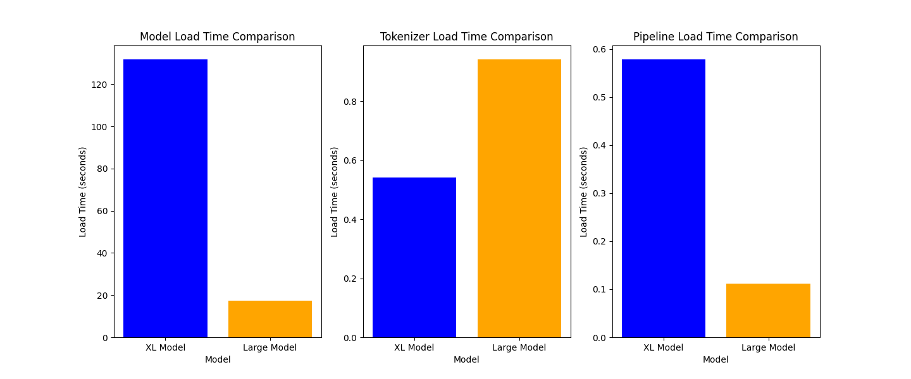
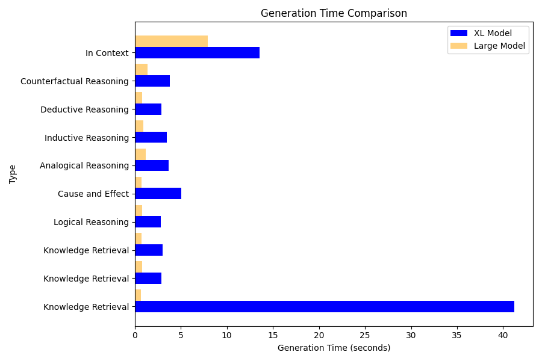

# Testing LLMs with LangChain in a local environment for (6) types of reasoning

Within (30) minutes of reading this post, you should be able to complete model serving requests from two variants of a popular python-based large language model (LLM) using LangChain on your local computer without requiring the connection or costs to an external 3rd party API server, such as HuggingFaceHub or OpenAI.  This exercise provides the scripts that will enable you to test these LLMs' capabilities in answering three prompt types i.e. knowledge retrieval, six forms of reasoning questions and a long question with details in context.  After providing some background on the models and LangChain, we will walk you through installing dependencies, and we will provide the code and the output of each model.   We will also provide side by side comparisons on model performance and processing times.  

Caveats and notes - Although you will not need a real-time connection to HuggingFace for model serving, you will need a connection to Huggingface to fetch code. 

## Why run local

Some of the reasons why you may need to run your model locally, and not use an external API server, include:

* Security
    * You might want to fine tune the model and not post the derivative model on an external API server.
* Cost
    * You might want to avoid paying an external company for API calls. 
* Performance
    * You might need to manage your model's response times by using a private network and/or a specific server / processor type.
* Functionality
    * Your model might only run locally (e.g. Blenderbot, Meta's chatbot models).


## Large Language Models - Flan-T5-Large and Flan-T5-XL

In this blog, we will show the process to run the Flan-T5-Large and Flan-T5-XL models.   This family of transformer models, open sourced from Google, is designed for natural language processing tasks and provides both text-to-text and text generation capabilities, especially for question answering. 

The Flan-T5-Large version is based on the T5 (Text-To-Text Transfer Transformer) architecture and has 780M parameters.  This [paper](https://arxiv.org/pdf/2210.11416.pdf), which provides the following chart, claims that the Flan-T5-Large achieved a MMLU Direct score of 45.1%, which is pretty good when compared to ChatGPT-3's score of 43.9% (see page 10). It is a fairly popular model, which had 446,125 downloads last month. For more detailed information on this model’s background, performance and capabilities, please see this [link](https://huggingface.co/google/flan-t5-large) on HuggingFaceHub. For reference, the Measuring Massive Multitask Language Understanding(MMLU) tests cover 57 tasks including elementary mathematics, US history, computer science, law, and more. To attain high accuracy on this test, models must possess extensive world knowledge and problem solving ability.  Please find more on MMLU in this [paper](https://arxiv.org/pdf/2009.03300.pdf).

The Flan-T5-xl version is based on the T5 (Text-To-Text Transfer Transformer) architecture and has 3B parameters.   It is a fairly popular model, which had 349,257 downloads last month. It achieved a MMLU score of 52%, which is better than T5-Large and ChatGPT-3.  For more detailed information on this model’s background, performance and capabilities, please see this link on HuggingFaceHub, [https://huggingface.co/google/flan-t5-xl](https://huggingface.co/google/flan-t5-xl). 


## LangChain - What is it? Why use it?

The text in this section is from [https://python.LangChain.com/en/latest/index.html](https://python.langchain.com/en/latest/index.html) 

LangChain is a framework for developing applications powered by language models. We believe that the most powerful and differentiated applications will not only call out to a language model, but will also be:

1. _Data-aware_: connect a language model to other sources of data
2. _Agentic_: allow a language model to interact with its environment

The LangChain framework is designed around these principles.  This is the Python specific portion of the documentation. For a purely conceptual guide to LangChain, see [here](https://docs.langchain.com/docs/). For the JavaScript documentation, see [here](https://js.langchain.com/docs/). For concepts and terminology, please see [here](https://python.langchain.com/en/latest/getting_started/concepts.html).

## Modules

These modules are the core abstractions which we view as the building blocks of any LLM-powered application. For each module LangChain provides standard, extendable interfaces. LangChain also provides external integrations and even end-to-end implementations for off-the-shelf use. The docs for each module contain quickstart examples, how-to guides, reference docs, and conceptual guides.

The modules are (from least to most complex):

* [Models](https://python.langchain.com/en/latest/modules/models.html): Supported model types and integrations.
* [Prompts](https://python.langchain.com/en/latest/modules/prompts.html): Prompt management, optimization, and serialization.
* [Memory](https://python.langchain.com/en/latest/modules/memory.html): Memory refers to the state that is persisted between calls of a chain/agent.
* [Indexes](https://python.langchain.com/en/latest/modules/indexes.html): Language models become much more powerful when combined with application-specific data - this module contains interfaces and integrations for loading, querying and updating external data.
* [Chains](https://python.langchain.com/en/latest/modules/chains.html): Chains are structured sequences of calls (to an LLM or to a different utility).
* [Agents](https://python.langchain.com/en/latest/modules/agents.html): An agent is a Chain in which an LLM, given a high-level directive and a set of tools, repeatedly decides an action, executes the action and observes the outcome until the high-level directive is complete.
* [Callbacks](https://python.langchain.com/en/latest/modules/callbacks/getting_started.html): Callbacks let you log and stream the intermediate steps of any chain, making it easy to observe, debug, and evaluate the internals of an application.

## Use Cases

Best practices and built-in implementations for common LangChain use cases:

* [Autonomous Agents](https://python.langchain.com/en/latest/use_cases/autonomous_agents.html): Autonomous agents are long-running agents that take many steps in an attempt to accomplish an objective. Examples include AutoGPT and BabyAGI.
* [Agent Simulations](https://python.langchain.com/en/latest/use_cases/agent_simulations.html): Putting agents in a sandbox and observing how they interact with each other and react to events can be an effective way to evaluate their long-range reasoning and planning abilities.
* [Personal Assistants](https://python.langchain.com/en/latest/use_cases/personal_assistants.html): One of the primary LangChain use cases. Personal assistants need to take actions, remember interactions, and have knowledge about your data.
* [Question Answering](https://python.langchain.com/en/latest/use_cases/question_answering.html): Another common LangChain use case. Answering questions over specific documents, only utilizing the information in those documents to construct an answer.
* [Chatbots](https://python.langchain.com/en/latest/use_cases/chatbots.html): Language models love to chat, making this a very natural use of them.
* [Querying Tabular Data](https://python.langchain.com/en/latest/use_cases/tabular.html): Recommended reading if you want to use language models to query structured data (CSVs, SQL, dataframes, etc).
* [Code Understanding](https://python.langchain.com/en/latest/use_cases/code.html): Recommended reading if you want to use language models to analyze code.
* [Interacting with APIs](https://python.langchain.com/en/latest/use_cases/apis.html): Enabling language models to interact with APIs is extremely powerful. It gives them access to up-to-date information and allows them to take actions.
* [Extraction](https://python.langchain.com/en/latest/use_cases/extraction.html): Extract structured information from text.
* [Summarization](https://python.langchain.com/en/latest/use_cases/summarization.html): Compressing longer documents. A type of Data-Augmented Generation.
* [Evaluation](https://python.langchain.com/en/latest/use_cases/evaluation.html): Generative models are hard to evaluate with traditional metrics. One promising approach is to use language models themselves to do the evaluation.

As you can see, LangChain includes many advanced features and it enables complex model processing.   In our example, we will use models, prompts, and pipelines for question answering.

## Step 1 - Installing dependencies for the models (#step1)

After installing the software above, you will need to install the dependencies.  From the terminal, please run the commands below:

```
pip3 install transformers
pip3 install langchain
pip3 install torch
pip3 install matplotlib
```

## Build your python script, T5pat.py

After installing the dependencies, please build your python script.   In your terminal or code editor, please create a file, t5pat.py, in your directory i.e. t5pat, and cut and paste in following code into your t5pat.py file.

```
import time
import matplotlib.pyplot as plt
from langchain.llms import HuggingFacePipeline
from transformers import AutoTokenizer, AutoModelForSeq2SeqLM, pipeline

import os
# Disable parallelism and avoid the warning message
os.environ["TOKENIZERS_PARALLELISM"] = "false"

# Define model IDs
model_ids = ['google/flan-t5-large', 'google/flan-t5-xl']

# Define prompts and types
prompts = [
    'What is the capital of Germany?',
    'What is the capital of Spain?',
    'What is the capital of Canada?',
    'What is the next number in the sequence: 2, 4, 6, 8, ...? If all cats have tails, and Fluffy is a cat, does Fluffy have a tail?',
    'If you eat too much junk food, what will happen to your health? How does smoking affect the risk of lung cancer?',
    'In the same way that pen is related to paper, what is fork related to? If tree is related to forest, what is brick related to?',
    'Every time John eats peanuts, he gets a rash. Does John have a peanut allergy? Every time Sarah studies for a test, she gets an A. Will Sarah get an A on the next test if she studies?',
    'All dogs have fur. Max is a dog. Does Max have fur? If it is raining outside, and Mary does not like to get wet, will Mary take an umbrella?',
    'If I had studied harder, would I have passed the exam? What would have happened if Thomas Edison had not invented the light bulb?',
    'The center of Tropical Storm Arlene, at 02/1800 UTC, is near 26.7N 86.2W. This position is about 425 km/230 nm to the west of Fort Myers in Florida, and it is about 550 km/297 nm to the NNW of the western tip of Cuba. The tropical storm is moving southward, or 175 degrees, 4 knots. The estimated minimum central pressure is 1002 mb. The maximum sustained wind speeds are 35 knots with gusts to 45 knots. The sea heights that are close to the tropical storm are ranging from 6 feet to a maximum of 10 feet.  Precipitation: scattered to numerous moderate is within 180 nm of the center in the NE quadrant. Isolated moderate is from 25N to 27N between 80W and 84W, including parts of south Florida.  Broad surface low pressure extends from the area of the tropical storm, through the Yucatan Channel, into the NW part of the Caribbean Sea.   Where and when will the storm make landfall?'
]

types = [
    'Knowledge Retrieval',
    'Knowledge Retrieval',
    'Knowledge Retrieval',
    'Logical Reasoning',
    'Cause and Effect',
    'Analogical Reasoning',
    'Inductive Reasoning',
    'Deductive Reasoning',
    'Counterfactual Reasoning',
    'In Context'
]

# Create empty lists to store generation times, model load times, tokenizer load times, and pipeline load times
xl_generation_times = []
large_generation_times = []

xl_model_load_times = []
large_model_load_times = []

xl_tokenizer_load_times = []
large_tokenizer_load_times = []

xl_pipeline_load_times = []
large_pipeline_load_times = []

prompt_types = []

for model_id in model_ids:
    # Load tokenizer
    tokenizer_start_time = time.time()
    tokenizer = AutoTokenizer.from_pretrained(model_id)
    tokenizer_end_time = time.time()

    # Load model
    model_start_time = time.time()
    model = AutoModelForSeq2SeqLM.from_pretrained(model_id)
    model_end_time = time.time()

    # Load pipeline
    pipe_start_time = time.time()
    pipe = pipeline("text2text-generation", model=model, tokenizer=tokenizer, max_length=512)
    local_llm = HuggingFacePipeline(pipeline=pipe)
    pipe_end_time = time.time()

    # Store loading times
    if model_id == 'google/flan-t5-large':
        large_model_load_times.append(model_end_time - model_start_time)
        large_tokenizer_load_times.append(tokenizer_end_time - tokenizer_start_time)
        large_pipeline_load_times.append(pipe_end_time - pipe_start_time)
    elif model_id == 'google/flan-t5-xl':
        xl_model_load_times.append(model_end_time - model_start_time)
        xl_tokenizer_load_times.append(tokenizer_end_time - tokenizer_start_time)
        xl_pipeline_load_times.append(pipe_end_time - pipe_start_time)

    # Print model results
    print()
    print(f"Results for model: {model_id}")
    print("=" * 30)

    # Knowledge retrieval examples
    for i, prompt in enumerate(prompts):
        start_time = time.time()
        answer = local_llm(prompt)
        end_time = time.time()
        print(f"Prompt: {prompt}")
        print(f"Answer: {answer}")
        print(f"Generation Time: {end_time - start_time:.5f} seconds")
        print(f"Type: {types[i]}")
        print()

        prompt_types.append(types[i])  # Store the prompt type

        if model_id == 'google/flan-t5-large':
            large_generation_times.append(end_time - start_time)
        elif model_id == 'google/flan-t5-xl':
            xl_generation_times.append(end_time - start_time)

    print(f"Loading times for model {model_id}")
    print("Tokenizer Loading Time:", f"{tokenizer_end_time - tokenizer_start_time:.5f}", "seconds")
    print("Model Loading Time:", f"{model_end_time - model_start_time:.5f}", "seconds")
    print("Pipeline Loading Time:", f"{pipe_end_time - pipe_start_time:.5f}", "seconds\n\n")


# Plot model load times
model_load_times = [sum(xl_model_load_times), sum(large_model_load_times)]
model_labels = ['XL Model', 'Large Model']

plt.figure(figsize=(18, 6))
plt.subplot(131)
plt.bar(model_labels, model_load_times, color=['blue', 'orange'])
plt.ylabel('Load Time (seconds)')
plt.xlabel('Model')
plt.title('Model Load Time Comparison')

# Plot tokenizer load times
tokenizer_load_times = [sum(xl_tokenizer_load_times), sum(large_tokenizer_load_times)]

plt.subplot(132)
plt.bar(model_labels, tokenizer_load_times, color=['blue', 'orange'])
plt.ylabel('Load Time (seconds)')
plt.xlabel('Model')
plt.title('Tokenizer Load Time Comparison')

# Plot pipeline load times
pipeline_load_times = [sum(xl_pipeline_load_times), sum(large_pipeline_load_times)]
plt.subplot(133)
plt.bar(model_labels, pipeline_load_times, color=['blue', 'orange'])
plt.ylabel('Load Time (seconds)')
plt.xlabel('Model')
plt.title('Pipeline Load Time Comparison')

# Plot generation times
plt.figure(figsize=(9, 6))
plt.barh(range(len(types)), xl_generation_times, height=0.4, align='center', color='blue', label='XL Model')
plt.barh([x + 0.4 for x in range(len(types))], large_generation_times, height=0.4, align='center', color='orange', alpha=0.5, label='Large Model')
plt.yticks(range(len(types)), types)
plt.ylabel('Type')
plt.xlabel('Generation Time (seconds)')
plt.title('Generation Time Comparison')
plt.legend()

plt.tight_layout()
plt.show()
```

## Run your script

To run your script, please open your terminal to the directory that holds the file, i.e. t5pat.   Then run the following statement:

```
python3 t5pat.py
````

## Sample script output

The following provides sample model output from running the script. Your answers and generation times will likely be different.   The script has a text output followed by four charts.  You can save the charts using the file button on the chart displays or just close them out.  Either action will release the script and bring you back to the terminal prompt.

```

Results for model: google/flan-t5-large
==============================
Prompt: What is the capital of Germany?
Answer: berlin
Generation Time: 1.06194 seconds
Type: Knowledge Retrieval

Prompt: What is the capital of Spain?
Answer: turin
Generation Time: 0.73172 seconds
Type: Knowledge Retrieval

Prompt: What is the capital of Canada?
Answer: toronto
Generation Time: 1.12487 seconds
Type: Knowledge Retrieval

Prompt: What is the next number in the sequence: 2, 4, 6, 8, ...? If all cats have tails, and Fluffy is a cat, does Fluffy have a tail?
Answer: yes
Generation Time: 1.08774 seconds
Type: Logical Reasoning

Prompt: If you eat too much junk food, what will happen to your health? How does smoking affect the risk of lung cancer?
Answer: no
Generation Time: 0.69614 seconds
Type: Cause and Effect

Prompt: In the same way that pen is related to paper, what is fork related to? If tree is related to forest, what is brick related to?
Answer: brick is related to brick
Generation Time: 1.51508 seconds
Type: Analogical Reasoning

Prompt: Every time John eats peanuts, he gets a rash. Does John have a peanut allergy? Every time Sarah studies for a test, she gets an A. Will Sarah get an A on the next test if she studies?
Answer: yes
Generation Time: 1.24550 seconds
Type: Inductive Reasoning

Prompt: All dogs have fur. Max is a dog. Does Max have fur? If it is raining outside, and Mary does not like to get wet, will Mary take an umbrella?
Answer: yes
Generation Time: 1.28181 seconds
Type: Deductive Reasoning

Prompt: If I had studied harder, would I have passed the exam? What would have happened if Thomas Edison had not invented the light bulb?
Answer: no one would have invented the light bulb
Generation Time: 2.15294 seconds
Type: Counterfactual Reasoning

Prompt: The center of Tropical Storm Arlene, at 02/1800 UTC, is near 26.7N 86.2W. This position is about 425 km/230 nm to the west of Fort Myers in Florida, and it is about 550 km/297 nm to the NNW of the western tip of Cuba. The tropical storm is moving southward, or 175 degrees, 4 knots. The estimated minimum central pressure is 1002 mb. The maximum sustained wind speeds are 35 knots with gusts to 45 knots. The sea heights that are close to the tropical storm are ranging from 6 feet to a maximum of 10 feet.  Precipitation: scattered to numerous moderate is within 180 nm of the center in the NE quadrant. Isolated moderate is from 25N to 27N between 80W and 84W, including parts of south Florida.  Broad surface low pressure extends from the area of the tropical storm, through the Yucatan Channel, into the NW part of the Caribbean Sea.   Where and when will the storm make landfall?
Answer: about 425 km/230 nm to the west of Fort Myers in Florida, and it is about 550 km/297 nm to the NNW of the western tip of Cuba
Generation Time: 10.67541 seconds
Type: In Context

Loading times for model google/flan-t5-large
Tokenizer Loading Time: 0.94174 seconds
Model Loading Time: 17.28348 seconds
Pipeline Loading Time: 0.11213 seconds


Loading checkpoint shards: 100%|██████████████████| 2/2 [01:38<00:00, 49.17s/it]

Results for model: google/flan-t5-xl
==============================
Prompt: What is the capital of Germany?
Answer: berlin
Generation Time: 43.58305 seconds
Type: Knowledge Retrieval

Prompt: What is the capital of Spain?
Answer: santander
Generation Time: 2.80783 seconds
Type: Knowledge Retrieval

Prompt: What is the capital of Canada?
Answer: ottawa
Generation Time: 3.06489 seconds
Type: Knowledge Retrieval

Prompt: What is the next number in the sequence: 2, 4, 6, 8, ...? If all cats have tails, and Fluffy is a cat, does Fluffy have a tail?
Answer: yes
Generation Time: 2.89040 seconds
Type: Logical Reasoning

Prompt: If you eat too much junk food, what will happen to your health? How does smoking affect the risk of lung cancer?
Answer: It increases the risk of developing lung cancer.
Generation Time: 5.07974 seconds
Type: Cause and Effect

Prompt: In the same way that pen is related to paper, what is fork related to? If tree is related to forest, what is brick related to?
Answer: building
Generation Time: 2.60167 seconds
Type: Analogical Reasoning

Prompt: Every time John eats peanuts, he gets a rash. Does John have a peanut allergy? Every time Sarah studies for a test, she gets an A. Will Sarah get an A on the next test if she studies?
Answer: yes
Generation Time: 3.53700 seconds
Type: Inductive Reasoning

Prompt: All dogs have fur. Max is a dog. Does Max have fur? If it is raining outside, and Mary does not like to get wet, will Mary take an umbrella?
Answer: yes
Generation Time: 2.90499 seconds
Type: Deductive Reasoning

Prompt: If I had studied harder, would I have passed the exam? What would have happened if Thomas Edison had not invented the light bulb?
Answer: the world would be dark
Generation Time: 3.81147 seconds
Type: Counterfactual Reasoning

Prompt: The center of Tropical Storm Arlene, at 02/1800 UTC, is near 26.7N 86.2W. This position is about 425 km/230 nm to the west of Fort Myers in Florida, and it is about 550 km/297 nm to the NNW of the western tip of Cuba. The tropical storm is moving southward, or 175 degrees, 4 knots. The estimated minimum central pressure is 1002 mb. The maximum sustained wind speeds are 35 knots with gusts to 45 knots. The sea heights that are close to the tropical storm are ranging from 6 feet to a maximum of 10 feet.  Precipitation: scattered to numerous moderate is within 180 nm of the center in the NE quadrant. Isolated moderate is from 25N to 27N between 80W and 84W, including parts of south Florida.  Broad surface low pressure extends from the area of the tropical storm, through the Yucatan Channel, into the NW part of the Caribbean Sea.   Where and when will the storm make landfall?
Answer: Fort Myers in Florida
Generation Time: 14.06618 seconds
Type: In Context

Loading times for model google/flan-t5-xl
Tokenizer Loading Time: 0.54048 seconds
Model Loading Time: 131.81162 seconds
Pipeline Loading Time: 0.57841 seconds
```




Note - the following might display on the terminal while the figures are rendering.   This message is informational.

``` 
Python[23374:939566] +[CATransaction synchronize] called within transaction 
```

## Review of the script's output and performance

For each model, the script prints text output for each prompt including the prompt, answer, generation time and prompt type.   It provides a text output on the loading times for the model, tokenizer and pipeline times.   It produces charts for generation time for each prompt type and load times for the model, tokenizer and pipeline.   

In our tests, the XL model took significantly longer in all aspects than the Large model, but the XL model answered more questions correctly. Neither model did a good job with prompts that contained two questions and both models mostly answered the second question and ignored the 1st question.    The answers did not provide much context, although we did not ask for context.   Determining what is correct or incorrect for a reasoning question could have some subjectivity.    The XL was stronger than the Large model on knowledge retrieval, in context, cause and effect, and analogical reasoning.  The XL did not perform well initially on analogical or counterfactual questions but its answers improved as we ran more epochs.   Both models were better at answering reasoning questions than knowledge retrieval or in context questions.

The following table provides a summary of the models' correct answers.  We recognize that the format of the prompts, especially asking two questions in one prompt, can impact the model.   We used these more complex examples as they might reflect human interaction.  As you can see, the model's performance can vary depending on the question type and the prompt construction.   This is to be expected and could be fine tuned, which is a potential topic for follow-on discussions and/or further experimentations.


### Summary for the Large model

The Large model did not answer the first question in the prompts which contained multiple questions.  If you count the first questions, the Large model missed more questions than it answered correctly.  Additionally, the answers did not provide much context, but to fair, we did not ask for context in the answer.   Determining what is correct or incorrect for a reasoning question could have some subjectivity.

Let's analyze the output for the Large model's output. This chart provides the question types, the correctness of the answer, and the time required to generate the pipelines answers.

| Prompt| Correct | Time in sec |
| --- | --- | --- |
| Knowledge retrieval 1 | 100%| 1.1 |
| Knowledge retrieval 2 |   0%| 0.7 |
| Knowledge retrieval 3 |   0%| 1.1 |
| Logical Reasoning | 50% | 1.1 | 
| Cause Effect Reasoning | 0% | 0.7 |
| Analogical Reasoning | 0%| 1.5 |
| Inductive Reasoning | 50% | 1.2 |
| Deductive Reasoning | 50%| 1.3 |
| Counterfactual Reasoning | 50% | 2.2 |
| In Context | 0%| 10.7 |

### XL Model Review

Now, let's examine the results of the flan-t5-xl model. The information message below is printed as the script loads checkpoint shards as part of initializing the model and tokenizer.  This appears to take 49 seconds and there is a delay between the Large model output completion and the start of output from the XL Model.

```
Loading checkpoint shards: 100%|██████████████████| 2/2 [01:38<00:00, 49.17s/it]
```
Next let's analyze output for the XL model's output. This chart provides the question types, the correctness of the answer, and the time required to generate the pipelines answers.

| Prompt| Correct | Time in sec |
| --- | --- | --- |
| Knowledge retrieval 1| 100%| 43.6 |
| Knowledge retrieval 2 |   0%| 2.8 |
| Knowledge retrieval 3 | 100%| 3.1 |
| Logical Reasoning | 50% | 2.9 | 
| Cause Effect Reasoning | 50% | 5.1 |
| Analogical Reasoning | 50%| 2.6 |
| Inductive Reasoning | 50% | 3.5 |
| Deductive Reasoning | 50%| 2.9 |
| Counterfactual Reasoning | 50% | 3.8 |
| In Context | 25%| 14.1 |

The XL model did a pretty good job.   It answered (2) of the (3) Knowledge retrieval questions correctly.   It answered all of the reasoning questions correctly and it provided an answer for the In Context question that could be correct.    From a grading standpoint, it only answered the second question in the reasoning prompts, and so we gave it a grade of 50% for answering those prompts.

This initial post is intended to provide a first cut of this effort to test reasoning.   In a follow-on post, we plan to provide more details and descriptions of the code and output, along with suggested further reading.   

We hope this post helps to get you started with testing LLMs.


